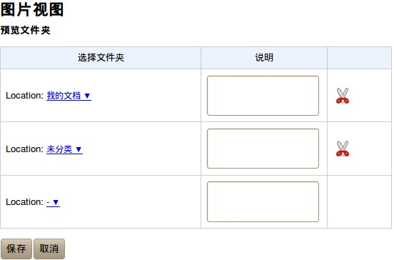

======================
　文件库相册
======================

作者：徐淘哲 （润普实习生）

介绍
=====
可以让您的自定义的图片储存文件夹，里面好看的图片,更加方便的呈现出来。

主要功能：

    1.文件夹图片预览

    2.文件夹可自定义

效果：

进入应用后，可选择自定义的文件夹预览：

当点进某一个文件夹后：

查看某副图的效果：

使用方法
=========

栏目说明:

请您在选择文件夹栏目上选择您需要预览图片的文件夹。请至少添加一行栏目。
说明一栏是可选的，可随意填写。
