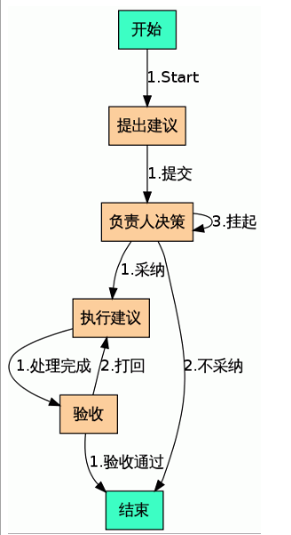

=================
合理化建议
=================

合理化建议是企业日常工作常用的流程之一，由员工提出合理化建议，负责人采纳、不采纳、或挂起，采纳的建议需指派给相关部门及负责人，给出建议方案，以及要求完成时间，指定验收人。

提建议的人填写以下表单。

.. image:: img/proposal1.png

根据相关负责人的处理结果，表单进入相应的阶段。

合理化建议的流程如下。

