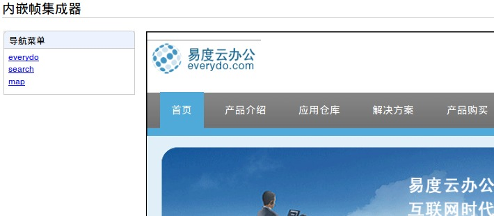
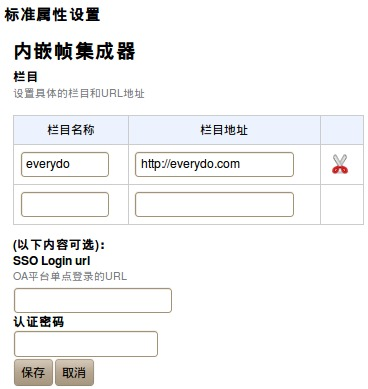

==============================
　内嵌帧集成器
==============================

介绍
======
本程序可以让您更加方便访问和我们有合作关系的网站，而只需要简单的设置。

主要功能：

    1. 多系统的单点登录

    2. 多栏目导航

效果：

使用方法：
================
设置栏目截图：

各个设置栏目的说明:

请在您的应用管理器里面选择应用设置。然后在OA栏目那一栏，设置好栏目名称，和您需要访问的网站地址到栏目地址里面，
您可以根据需要填写一个或多个，请至少设置一栏。这样本程序就可以正藏运作了。

如果您需要访问的网站需要身份验证。请在可选内容里面填写SSO Login url 和 认证密码。
SSO Login url 是您的身份验证的网址，详情请咨询管理员或者联系您需要访问网站。
认证密码 是您需要访问网站所需要的密码。

注意事项
=================
如果您设置了可选内容。
在访问每一个栏目的时候，都会进行身份验证，然后载入栏目。
如果您访问网站需要不同的身份验证 或者访问两个不同的网站，请再建立多一个或多个应用程序。

单点登录协议介绍
===========================
单点登录（single Sign On），简称为 SSO，是目前比较流行的企业业务整合的解决方案之一。SSO的定义是在多个应用系统中，
用户只需要登录一次就可以访问所有相互信任的应用系统。它包括可以将这次主要的登录映射到其他应用中用于同一个用户的登录的机制。
