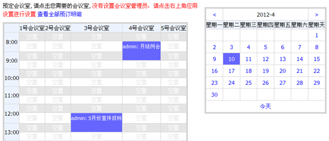

=======================
会议室管理
=======================

“会议室管理”插件，提供会议室的使用流程管理，包括会议前预订、人员安排、会议报告等。

**功能特点：**

- 图示化的方式展现会议室占用图
- 以清单形式查看使用情况，并可导出为xls表格
- 免审批的自助会议室预订
- 会议人员通知
- 可取消会议
- 支持会议报告
- 行政人员可以干预会议室预订

