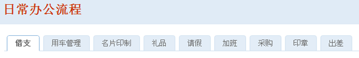
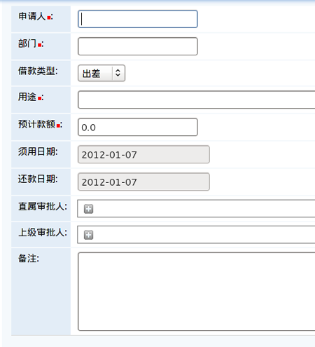
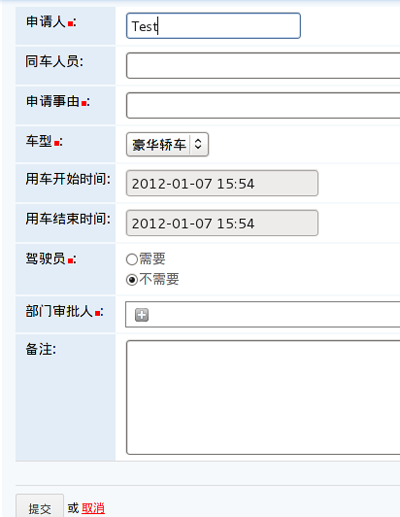
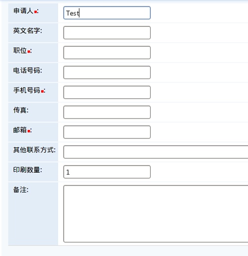
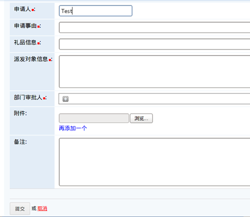
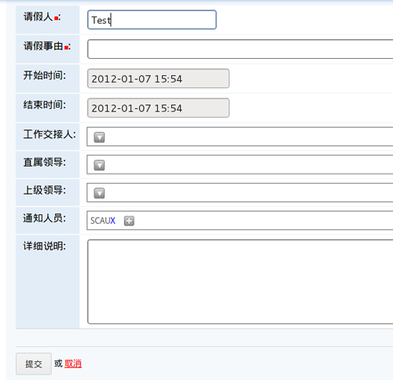
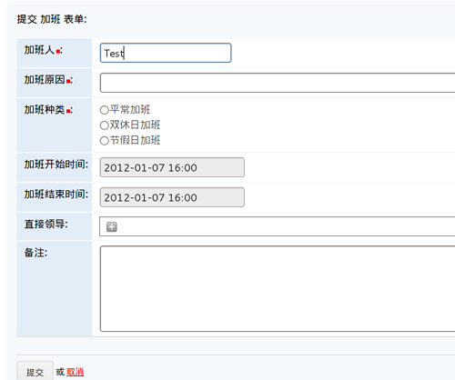
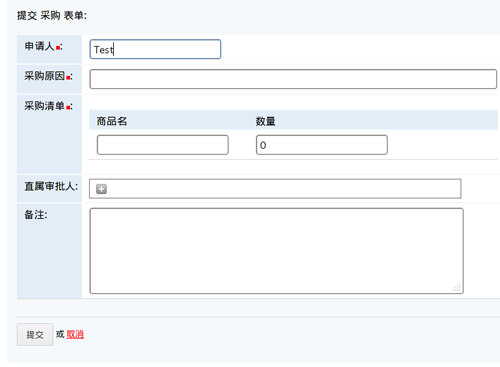
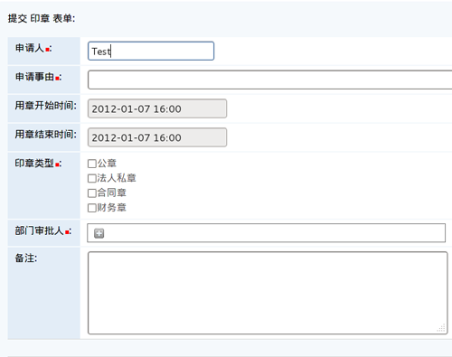
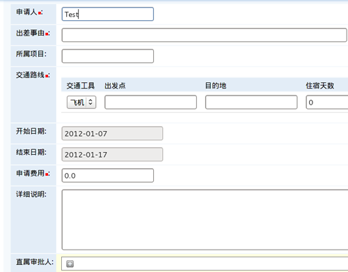

=============
日常办公流程
=============

日常办公流程包括名片制作、印章申请、礼品申请、出差申请、请款申请、采购申请、用车管理、办公用品申请, 请假申请, 加班登记等。

用户根据相应的流程填写所需的表单，然后表单开始传递给流程各个阶段的审核人，审核通过并执行。

.. contents:: 流程列表
.. sectnum::

借支
================
借支的申请表单，记录时间日期、用途等信息

用车管理
================
申请人填写以下表单，选择车型、是否需要驾驶员等

名片印制
================
名片印制申请表单，详细填写个人信息，并注明印制数量

礼品申请
================
申请人填写表单，负责人可以根据实际情况通过或者打回该请求

请假
================
请假人填写以下表单，详细注明交接人，确保工作正常进行，并需要领导审批

加班登记
================
加班登记表单

采购
================
采购清单比较简洁，填写商品名，数量等关键信息即可

印章申请
================
印章是企业的代表，使用时需要审批

出差
================
记录出差的路线、费用等信息，方便管理及统计工作

