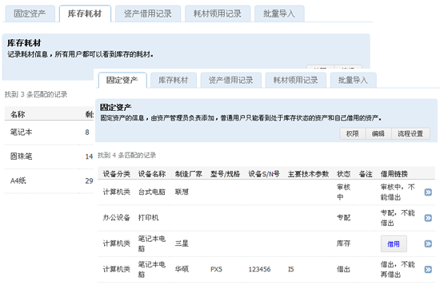
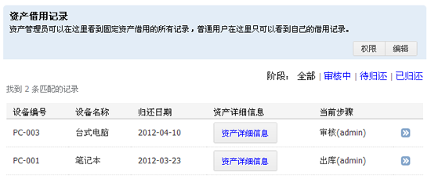
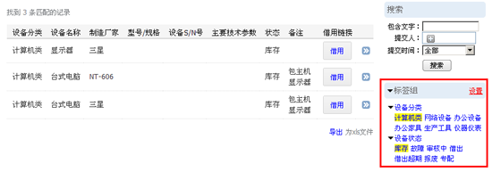

=========================================================
企业资产管理应用插件
=========================================================

“资产管理”提供简单的资产记录和流程管理功能，包括资产的借出和库存情况，使公司的资产情况一目了然。

功能特点介绍：
----------------------
- 固定资产、耗材集中管理和监控
- 资产、耗材借用记录
- 控制资产的使用流程
- 批量导入资产信息
- 资产数据可导出为xls表格
- 标签组分类管理及搜索

界面截图
-----------------------
固定资产和耗材管理

|

借用记录

|

标签组搜索

