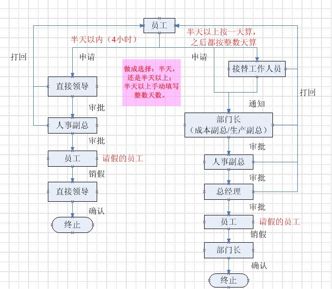
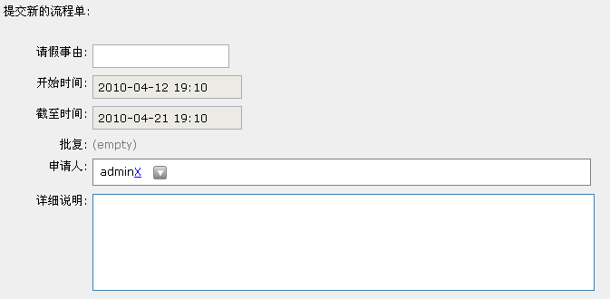

====================================
请假申请流程
====================================

zopen.leave是一个公司请假申请和审批的流程。
支持分部门审批，支持长请假交接管理。

流程图
==================

流程单
====================

1. 请假者只需填写以上的请假表单，即可发出请假请求
2. 流程会根据条件，判断半天以内或者半天以上所执行的流程指向，当然条件可以是其它你所需要的
3. 流程有个初始化设置，可以设置每个步骤的负责人，流程会自动寻找流程负责人去审批，也可以设置通知负责人的方式：系统消息，邮件，短信等
4. 流程执行过程中，也会有提示流程的步骤执行情况，可以很清晰地查看流程的当前情况

