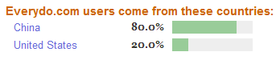

============================
令人费解的20%
============================

今天无意中打开google的Analytics（一个站点分析器），惊奇的发现这几天EveryDo访问者中居然有20%来自美国！真奇怪这些美国朋友打开这充斥着神奇方块字的网站看些什么？EveryDo目前既没有提供英文站点，也没有英文界面的程序供他们使用。还好EveryDo的站点和程序是支持UTF-8的，不至于打开来一片乱码，但即便是规规矩矩的中文字，恐怕这20%的到访者也一样是一头雾水。

这20%在Alexa上也得到了验证，但大洋彼岸的美国访客为什么要来EveryDo，他们又是从何而知EveryDo的呢？令人费解...

