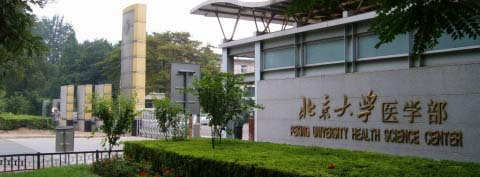

=============================
易度成功签约北京大学医学部
=============================

北京大学医学部（简称北医）位于学府林立的首都北京海淀区学院路，其前身是国立北京医学专门学校，创建于1912年10月26日，是中国政府教育部依靠中国自己的力量开办的第一所专门传授西方医学的国立学校。

易度根据教育行业的成功客户案例和北医的实际需求，定制了一套安全高效的文档管理系统。着重于权限控制和搜索功能，既保证学校海量文件的安全，同时也让这些文件能方便地利用。

了解更多 `成功案例 <http://www.edodocs.com/cases/#id68>`_ 

