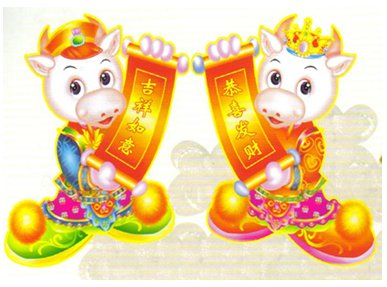

=================
EveryDo对联
=================

描述互联网：

   上联：GoWhereWantToGo

   下联：DoWhatWantToDo

   横批：JustDoIt

来一个EveryDo版的：

   上联：WorkOnlineWorkCollaborateWorkEasy

   下联：EveryOneEveryThingsEveryDo

   横批：GettingThingsDone

EveryDo的下联来源于海尔的OEC的管理思想中3E。

OEC：Overall Every Control and Clear 的缩写，即Overall（全方位）、Every（每人Everyone、每天Everyday、每件事Everything）、Control＆Clear（控制和清理）。 看百科中解释: http://baike.baidu.com/view/1541969.htm

GettingThingsDone是著名的GTD理念。

GTD的核心理念在于只有将你心中所想的所有的事情都写下来并且安排好下一步的计划，你才能够心无挂念，全力以赴地做好目前的工作，提高效率。看百科中的解释: http://baike.baidu.com/view/406078.htm
