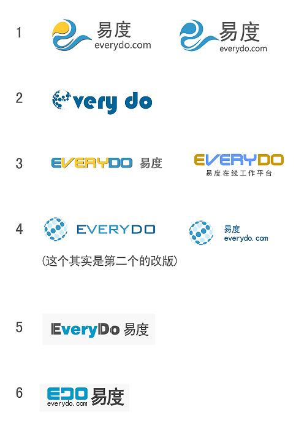

===================
易度LOGO诞生记
===================
LOGO，一个象征性的符号。在我看来，它应该是比网页设计要简单的。但是，在设计的过程中，我发现越是简单的东西，越磨砺人的创造力。

设计之初，必需了解LOGO要集中体现哪些理念。经过大家的讨论分析，最终确定了LOGO应该蕴含以下这些内容：

  1. 中文品牌：易度 

     易度云办公(平台)、易度在线工作(平台) 

  2. 英文： 

     edo：不变 

     everydo：主域名，需要推广 

根据这些雏形，我设计了第一个系列，但是很快被否定掉，因为图案不够清晰明了，
别人看不出里面蕴藏着EDO。

于是进行了第二次的LOGO理念推敲。

很多品牌的LOGO，它们都是以本身的英文作为LOGO。因为它们的英文品牌就是本身最好的广告标志。而在我们国家，我们学的是汉语。大多数人看到中文跟英文，第一反应会先把中文记住，所以这个在我们讨论中更坚定地要打造中文品牌。然而，对于一个网站来说，域名是重中之重。因此，第二个是要打造域名品牌。

EDO本来在设计元素中是首选的，后来有同事就提出这样的疑惑：EDO，别人不理解，不知道它是EVERYDO的简称。这样，域名就没法推广。即使客户记住它，也不会联想出EVERYDO是它的域名。因此往后的第二个第三个……系列里，只要出现它的，都基本被否决掉了。

而我设计当中，始终坚持着一个元素：圆。圆象征着一个循环，一个前进不止的步伐。

它不仅代表着易度的发展，还代表着易度能够为企业圆满解决办公管理中遇到的种种困难。即使路上有再多的荆棘也能辊压抚平。

经过一个多星期的奋战，同事们已经被我的LOGO视觉轰炸疲劳了。大家各抒己见，一会这样构图，一会这样搭配，一会要英文，一会不要英文。前前后后，我大概设计了接近50个版本。最后，我们还是采取了最原始的方法，投票决定。我挑选了6个版本的LOGO，如下图。

最后，投票结果是第三、第四为同票领先，关键一票留给了王总。花落四号。

经过最后的调整，易度的LOGO诞生了。

LOGO的图案，采用圆点构成一个大圆，而圆点当中利用深蓝色构成一个E。小圆点代表易度云办公中的文档、项目、部门、流程、报告、客户……这些元素，然后集合成为易度工作平台。同样的，圆的含义，像我上面所提到的一致。

这一个创造历程，可谓辛酸，充满考验与挑战。每每灵感缺乏，脑袋空空。我就趁着上洗手间的时候，把脑袋清清。据说很多创作灵感都来源于洗手间，这个确实不假。现在，大街上的广告，LOGO，路标……只要涉及到我的设计范围，眼睛很自然往那飘。相信这种视觉的敏锐性，大概就是这样锻炼出来的。

末了，露个小脸~

我，外号懒懒，今天是我工作刚满一个月的日子，跟大家分享我的设计历程。

