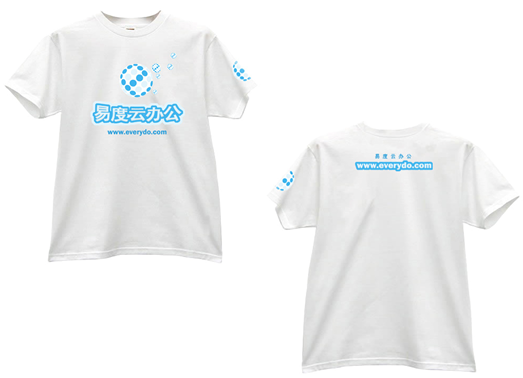

==============================
设计心得及T-Shirt发送
==============================

终于下雨了，畅快！
始终只有大雨才能淋漓尽致地洗涤闷热。
趁着这下雨的凉爽，坐在电脑前敲字，是一种惬意。
此时此刻，我觉得工作也是一种享受。

为了筹备云计算大会，我的设计工作从网页设计转到了平面设计上。很多方面的知识都是一边做一边学。而最主要的一个POINT，就是印刷问题。海报、宣传单、名片、T-SHIRT……需要印刷的知识掌握才能充分配好颜色。

而色彩的学问并非人人能掌握。它的把握能充分体现一个作品的表现能力。我自身的色彩感也不是很好，这个必须得不断地培养起来。每每看到别人优秀的作品，心里总是羡慕嫉妒恨啊！

设计的领域范围很广，大到建筑小到一颗螺丝。每一个领域总有让人学不完的地方。
对于一个刚毕业的我来说，经验没有，专业知识没有，有的只是对设计的一份热忱。而易度给予了我这个机会，让我踏出自己职业理想征途的第一步。

感谢易度！

最后，送出3件易度T-SHIRT给我们的易度粉丝。如有需要，尽早通过各种途径向我们索取，本消息在5月底前有效。

