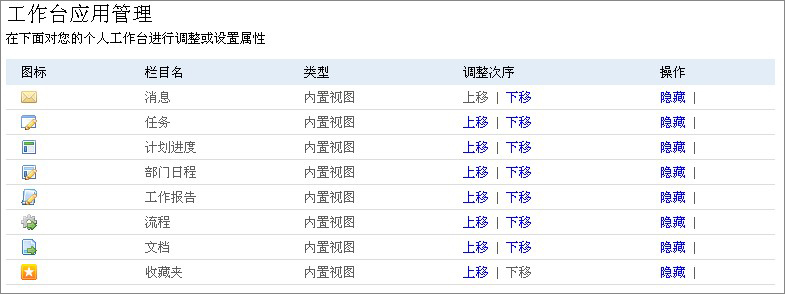
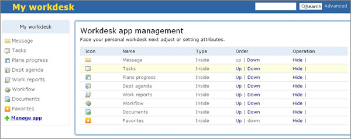

====================================
易度文档管理系统 V3.0.4.3 版本发布
====================================

易度团队，骄傲的宣布，易度文档管理系统 V3.0.4.3 版本发布。

这个版本，在底层和界面都做了许多优化，系统更稳定、体验更友好、功能更强，系统的可定制性也更加完善。

新的文档 flash 查看器
========================
我们全新编写了一个文档flash查看器，这个查看器中从前版本的基础上，有如下改进：

- 文档上传后，自动检查转换状态，完成后加载，无需手工刷新页面了
- 批量上传放拥塞：上传大量文档，不再会导致转换拥塞，会优先转换
- 支持文档打印
- 更好的网络异常处理，查看文档更流畅

可定制的个人工作台
========================
易度提供类似facebook等的个人工作台界面，用户可根据自己的需求，安装应用，调整栏目，构建最适合自己的个人工作界面。

另外，在扩展应用中，还可以自行开发新的应用，安装到个人工作台。

支持迅雷等下载加速器
=========================
国情是，大部分的用户都会安装迅雷等各种下载加速器。这个版本让易度和这些下载加速器兼容，可以直接采用这些下载加速器进行下载了。

定制内容的国际化支持
=========================
用户可自行部署栏目，新部署的栏目现在也可以支持国际化了。

现在支持中英文的国际化，除了栏目，还包括个人工作台栏目，自定义的流程、表单等，都支持国际化了。

文件夹目录 excel 导出
=========================
很多用户需要一个文件夹的内容清单，现在我们提供了文件夹内容导出功能。

导出的文件清单，会包括所有 “内容列表” 视图中的自定义列。

OCR 和双层 PDF 支持改进
=========================
这个版本，特别支持双层pdf。我们和文通(www.wintone.com)的OCR驱动进行了整合，设定规则后，上传文件，会自动进行双层PDF转换，转换的结果，会作为新版本保留。

改进 bug
=========================
- 在线用户插件可以工作
- 单点登录可修改自己的设置
- 去除“草稿”状态的显示
- 人员选择的时候，分公司放置到根节点处

