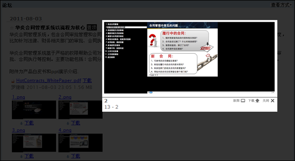
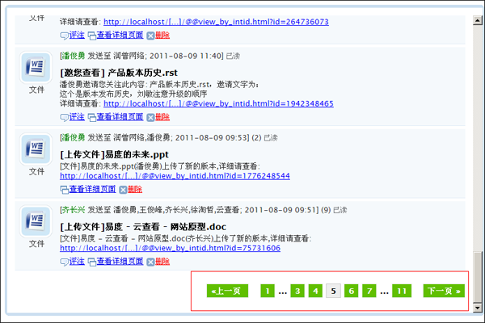
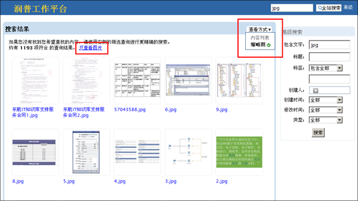
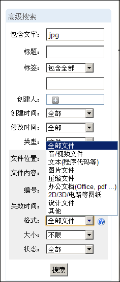
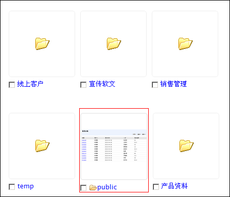
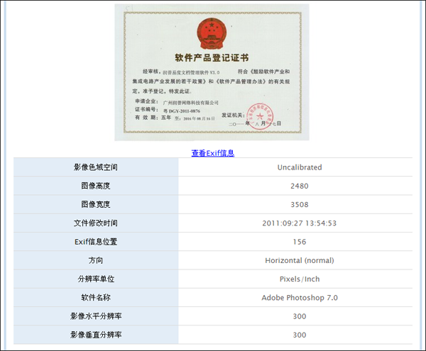

====================================
易度文档管理系统 V4.4 版本发布
====================================

`易度文档管理系统 <http://edodocs.com>`_ V4.4版当中， `易度云办公 <http://everydo.com>`_ 团队对系统功能进行了改进和完善，以及bug修复。

界面和部分操作优化改进：
========================
1. 修复系统的字体显示；

2. “我的工作台”模块 

    优化“消息”发信人名称显示，原来统一为“系统消息”，现在已经改为具体的发信人名字；
    
    优化“工作报告”模块的返回与删除的位置； 

3. “论坛”模块（部门和项目中有）：优化论坛帖子的附件图片查看，直接在本页弹出查看； 

4. 优化大部分页面的主要内容区框架配色，更加柔和； 

5. 优化系统中的分页页码显示效果，又清晰，又容易点击； 

6. “文档”模块优化： 

    优化文档目录树的 “+ -” 图标显示；
    
    “内容列表”模式下，优化了显示和排序操作；
    
    “最近更新”等摘要模式下，取消了文件编号的显示；
    
    优化“批量操作”，原来的操作提示放在右栏不易被发现，现在只要多选就会在页面顶部提示可以批量操作； 

    文档浏览，侧栏“文件标签”改为一个独立的区； 

    优化文档浏览页的收藏操作； 

搜索相关：
========================
1. 英文数字支持模糊搜索，比如 abc*, 可以搜索以abc打头的英文；

2. 全局搜索，增加搜索结果的显示方式“内容列表”和“缩略图”，缩略图模式下会提示用户是否只搜索图片；

3. 全局搜索，选择文件，由“文件格式”更改为“文件分类” ；

4. 排序后会显示出搜索结果提示；

转换和预览相关：
=========================
1. 不允许打印和文字选择的pdf，也能够预览；

2. 更好支持对office 2007的预览支持；

3. 提供独立的常用字体文件安装包，方便安装；

4. doc的预览，支持64位的win7系统；

5. 对同一文件不同大小的页面，可以正常的预览；

6. 相册视图，能随机显示和一张图片；

7. 照片支持exif信息的查看；

8. 如果浏览器不支持flash，需要明确提示用户需要安装flash；

账户管理相关： 
=========================
1. bug修正：人员岗位变化的时候，在系统选择框上选择员工的时候，还是原来的岗位，没有更新；

2. 如果设置ldap认证，用户帐户和密码完全和ldap同步，在系统内部开设的帐号全部失效；

3. 用户名可以包括 "."， 密码支持特殊字符；

消息模块：
=========================
1. bug: 消息搜索关键词，点击无变化；

2. 消息可直接评注相关内容，消息中心窗口上点击评论会提示当前页面的脚本错误；

3. 可快捷回复消息,消息详细页面，没输入回复消息直接点回复按钮，会出现"回复；

4. 内容为空!但回复按钮变成一直闪动的三点，无法在补充填写回复内容；

5. 批量删除消息出错；

安装程序和控制台：
=========================
1. 流程的阶段管理；

2. 文件服务器端同步方案；

3. windows2008 中安装系统的时候，会提示应该以管理员身份进行安装；

4. 通讯录模块，可限制查看手机信息的人；

集成扩展应用相关: 
=========================
1. 支持IP地址授权；

2. 外部编辑完成，提示用户刷新查看新内容和定版；

3. 文档审批流程，审核人改为并审；

4. 自定义表单，"文件直接上传"字段出错，会导致扩展属性添加不上处理；

5. iso文控的个人工作台点击报错；

6. (ISO文控) iso 中的编审，每一步都会通知入库的问题已经解决；

7. (ISO文控)分发会报错的问题已经解决；

8. (ISO文控)通知消息会乱码；

其他bug：
=========================
1. 关联文档禁止关联自己；

2. 文档操作历史增加改变状态，和定版；

3. 文件多版本，支持不同的文件类型比较；

4. 上传新版本，老版本的日期不正确。

产品升级请 `联系我们 <http://everydo.com/common/contact.rst>`_ 

