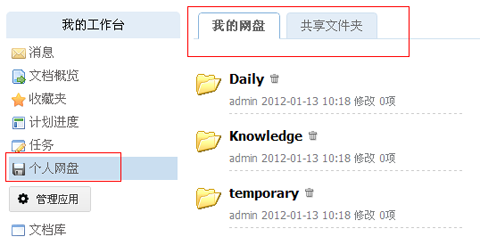
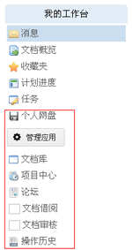
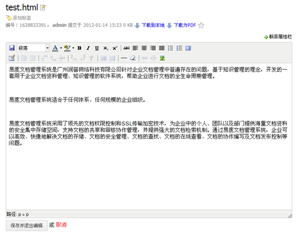
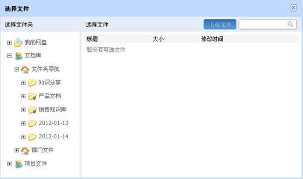
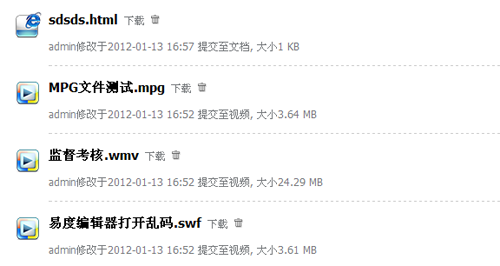
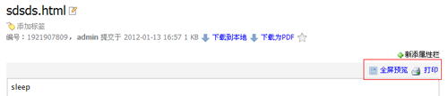

===========================================================
迎新年，易度文档管理系统V4.5贺岁版
===========================================================

最新版的文档管理系统，V4.5版，着重对软件的外观和功能做了优化。外观方面，比如某些按钮、功能键、整体布局等都作出修改；功能方面，我们重点对软件全部功能进行了整理，将一些陈旧的、没有被使用到的功能去除，使整个系统能够更加简洁。

- 界面更漂亮更精致更易用，特别是对支持html5的现代浏览器效果更佳，支持在ipad上查看系统里的文件 
- 性能更快，特别是对IE6支持更好 
- 更好的支持个人的文档管理和交换 

文档管理系统V4.5升级内容：
===============================

优化导航栏
---------------------
简化和整合了导航菜单，可浮动置顶，可显示消息通知，快速读取消息，管理变得更加方便；

|

更加个性化的工作台
-----------------------
在个人工作台中，我们加入了更多人性化的考虑，丰富了其中的应用，力求在个人工作台上就可以处理个人相关事务。

整合了“我的文档”和“网络共享”两个模块，合并为“个人网盘”，加强个人之间的文档共享和协作，直接到过工作台就可以分享文档了；

完善导航：增加应用清单；将“操作历史”、“文档概览”等应用放到了个人工作台；

增强在线文档编写功能
---------------------------
全屏编写、不退出的保存、右侧版本管理控制、整个编写界面的美化等；

新增文件选择组件
------------------------
文档管理系统V4.5版当中，在选择文件或者关联附件等操作时，支持在本地重新上传一个新的文件；同时，所有附件，都采用文件选择组件实现，左侧是系统的树状目录，右侧可以预览文件夹，较之以前的版本，这样会显得更清楚和准确；

更加醒目的提示框
---------------------------
删除、上传、修改文件等等，在操作完成时，系统顶部都会出现更明显的浮动提示，除了有更好的视觉效果外，同时也希望对用户操作起到提示和帮助的作用，尽量避免工作失误，就算失误了也可以第一时间知道并补救；

增强快捷方式，可显示预览图片，可显示原始文件的大小
---------------------------------------------------------
快捷方式其实是一个很常用的功能，免去了重复复制粘贴的痛苦，也不需要产生过多副本影响存储空间，让文件可以传播得更快；

统一文件附件和文件关联功能
------------------------------------
其实文件与其附件之间就是关联关系，所以新的文档管理系统将这种关联整合到一起，让文件之间的关联可以更方便；

简化网站栏目的设置，去除根栏目位置的设置
-------------------------------------------------
考虑到系统当中的部署应用会比较多，集中在网站栏目的页面会对用户的使用过程造成影响，所以我们对部署应用进行了整理，并相应简化了网站栏目的页面设置；

突出受控文件夹
-----------------------------------------------
给予更明显的警示和说明，除了改善图标，还在受控标签当中加入了相关的解释

简化文件列表和文件摘要的显示
-------------------------------------
隐藏了一些不常用的数据属性，令界面可以更加简洁

html文档查看器
---------------------------------
可以支持非弹出全屏查看和打印，使用起来会更加方便了

文档管理系统更多亮点
--------------------------

- 去除内容列表中的每页显示数量的设置，统一每页50个文件

- 个人工作台，不再用内嵌帧，而是AJAX

- 企业版可导入软件包

- 禁止新增 部门和工作组 这2个应用

- 文件详细页面增加路径

- 去除界面的帮助按钮

- 文档导航树，仅仅显示本文件库的文件夹，更简单

- bugfix：工作量时间格式支持

- bugfix: 3d预览权限改进
 
