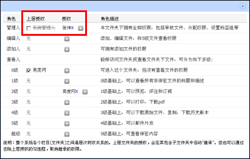

===========================================================
文档管理系统 V4.5.1 发布，安全保密性得到升级
===========================================================

文档管理系统 V4.5.1 是 V4.5 的升级版。本次升级，主要是对文档管理系统的保密功能方面做了完善和改进。

系统管理员权限可被禁用
............................
对于文件或文件夹，系统管理员的权限可被禁用，前提是管理员已经授权某用户成为文件或文件夹的管理人。对于之前的版本，系统管理员对文件或文件夹都拥有最高权限，且不能被禁用，增设此功能，可以避免IT管理员访问到企业的机密文档数据。

其他升级点
......................

**安装和控制台方面**

#. 档案管理初始化故障
#. 控制台更改端口不能成功
#. 即便设置防火墙，安装程序也能成功初始化数据库

**得到修改的bug**

#. 关闭个人区关闭，禁用个人网盘
#. 文件夹上传，默认就用flash上传
#. 去除pdf合并的功能
#. 关联附件，会重复关联
#. 文件上传字段，编辑的时候已有的文件丢失
#. 超大文件上传支持更好，解决内存不足的问题

