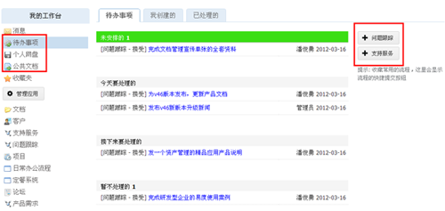
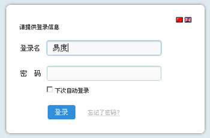
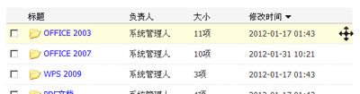
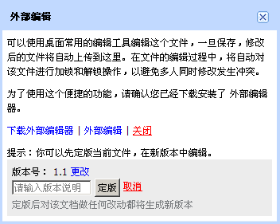
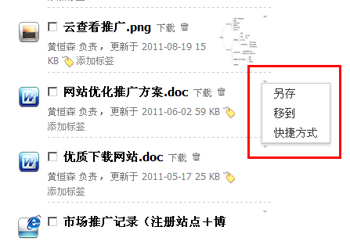

========================================
文档管理系统 V4.6 发布
========================================

文档管理系统 V4.6版，着重突出系统功能的可操作性，简化功能使用步骤，在整体架构不变的前提下，使文档管理系统的使用变得更简单和便捷。这是一个可安全升级的版本。

软件新功能
------------------------------

个人工作台的升级
+++++++++++++++++++++++++++++++++++++++++++++++
“流程”升级为“待办事项”。这模板可汇集所有需要你处理的工作、计划。分为未安排、今天处理、接下来处理、暂不处理四个部分，清晰地规划自己的工作任务，这功能也将逐步成为个人工作的中心。支持“拖动”操作，可在四个区间任意拖动排放任务

升级“收藏”功能，可以将自己常用的一些流程功能收藏到“待办事项”当中（在右侧显示），如下图，收藏了“问题跟踪”和“支持服务”

将“个人工作台”的“文档概览”改为“公共文档”，将“共享文件”，转移到“个人网盘”，工作台办公架构会更加清晰

自动登录文档管理系统
++++++++++++++++++++++++++++++++++
实现自动登录，可选择“下次自动登录” ，即使关闭浏览器后重新进入，也不需要再点击重新登录

提示：自动登录时间默认是7天时间

流程功能应用
++++++++++++++++++++++++++
流程支持多视图切换，对于已经完成的流程任务，管理员或任务最终步骤执行人可以“激活”流程，要求重新执行最后一步的流程任务

其他新功能
++++++++++++++++++++
- 应用市场升级：可直接通过互联网安装扩展软件包，升级扩展软件包更方便
- 为文件添加水印：可支持缩略图水印，需要在配置文件中设置
- 加强文档在线查看：支持7zip压缩文件和visio两种格式文件的在线查看预支持

|

产品优化
------------------------------

文档操作功能优化
++++++++++++++++++++++++++
- 突出了共享协作的功能，将“分享”提升到一个明显的位置
- 原本的“移到”，具体细分为3个功能：另存、移到、快捷方式。概念会更明确，操作也更便捷
- 改进邮件外发，突出此功能，交互更清晰
- 文件夹上，可以直接使用下拉菜单来另存、移动、快捷方式，可以直接设置标签
- 批量管理，去除标签维护、增加pdf合并功能，增加另存、快捷功能
- 改进“关注”和“收藏”，更具引导性。如上文所提及的，除了可以收藏文档文件我，还可以收藏流程到“待办事项”中，免去多个步骤点击使用

.. image:: img/docs-v46-img003.png
   :alt: 功能优化，另存为、移动、快捷方式、关注、收藏

其他升级优化要点
++++++++++++++++++++++++++++

- 文件夹目录，可采用拖动方式排序

- 外部编辑定版，会提示可以先“定版”，快捷保存当前文档版本，在新版本当中编辑，避免原文档被修改后，出现不必要的麻烦

- 在文件目录下，文档标题后，可快速对文档进行“另存”、“移到”或创建“快捷方式”的操作

- 明确文件夹负责人概念，负责人拥有对该文件夹的最高权限，下层文件夹会自动继承上层文件夹的负责人
- 改进注册界面，更简单、更清晰、更可靠
- 修复ipad查看word文档时，不能全屏和没有滚动条，两个问题
- 美化了错误信息提示界面
- 去除了特殊的temp文件夹
- 可直接从邮箱读取邮件和附件

已修复的故障/BUG
+++++++++++++++++++++++++++

- 开发平台出错行数提示不正确
- 转换文件名中有繁体中文的pdf时会报错
- 论坛不能添加新分类
- 外发文件预览页面，提供了“重新转换”的提示
- 流程单详细页面，不能手工添加标签
- 无正文消息会发送失败

