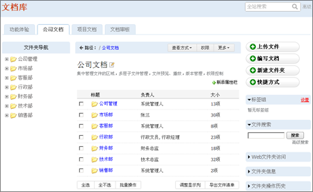

========================================
文档管理系统 V4.6.1 发布
========================================

因应市场发展和客户需求，易度团队会不断地系统的功能、外观等各方面进行完善和升级。

在3月份，易度团队升级并发布了 `文档管理系统V4.6版 <http://www.edodocs.com/blog/history/docs-v46-release.rst>`_ ，系统的可操作性有了很大的改进。但伴随而来的却是一些小问题，所以，发布文档管理系统 V4.6.1 版，针对一些BUG进行改进，保证客户的正常操作使用。

已修复的BUG：

- 动态表格里面，选择文件上传失败
- 发布的文件还能够改名
- 关闭发送邮件的调试日志
- 全站搜索后不能翻页
- redis安装后重启后不能工作

