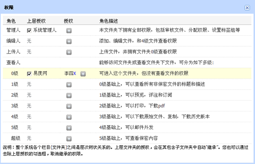

=======================================
文档管理系统推出 V4.6.4 版
=======================================

|

针对前面版本遗留下的问题，易度团队改善并发布文档管理系统 V4.6.4版

功能升级：

- 支持超大文件夹删除后的恢复，采用异步队列进行，增加frs队列
- 改进消息通知模块，避免消息冲突情况
- 权限功能：“添加人”更改为“上传人”，定义解释更明确，同时，在原来的基础上加上“0级查看人”（可进入文件夹，但不能查看文件夹内的文件）
- 加强批量操作按钮的显示
- 创建快捷方式，直接显示快捷方式的链接
- 文件夹排序，支持隐藏的文件夹
- 去除文件夹上方的“移动、复制 、删除”功能按钮，防止错误操作
- 设置为LDAP认证后，外公司人员无需LDAP认证也可以登录
- 去除不必要的重建索引操作（这3个授权不重建索引 1. 0级查看人 2. 上传人 3. 创建人 ）
- 个人工作台中公共文档和消息模块的改进

错误修复：

- 使用IE浏览器下载文件，报错
- Flash上传，不能上传到选择的文件夹
- 文件上传新版本后，没有给通知人授权
- 通知邮件，没有显示用户名问题