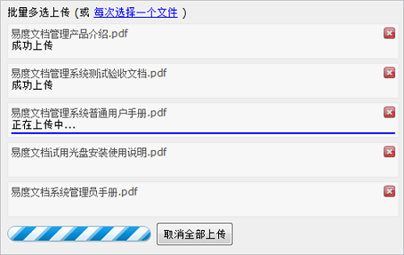
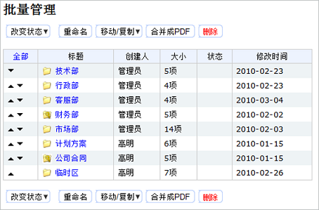
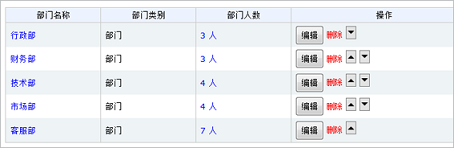
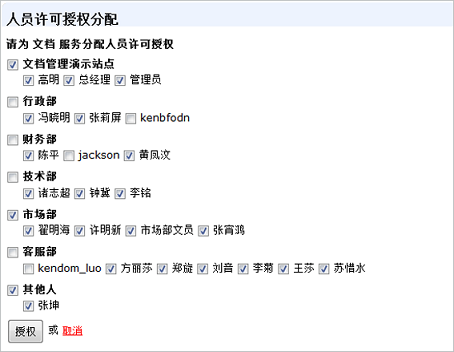
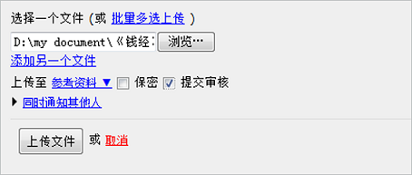

================================
易度企业文档管理系统V2.3发布！
================================

2.3在2.2版本的基础上做了大量的改进，以下是eodocs2.3的版本更新清单。

1. 功能增强：文档批量上传

2. 新增功能：文件夹支持排序

3. 新增功能：组织结构的部门等支持排序

4. 新增功能：能查看和设置每个服务的用户授权情况

5. 新增功能：在上传文档时可以直接提交审核

6. 新增功能：添加用户，和批量添加用户的时候，可选择是否发送通知邮件

具体内容如下：

**1 新增了文档批量上传的功能**

可一次性选择多个文档进行批量上传，在上传过程中可以查看进度和取消某个文档的上传。 这方便了经常需要大量上传文档的用户操作.

`深入了解易度文档批量上传 <http://everydo.com/blog/history/batch-upload.rst>`__

**2 新增了文件夹排序的功能**

可通过文件夹的批量管理功能，对文件夹进行排序。

**3 新增了组织结构的部门等支持排序的功能**

系统管理员可以通过使用该功能，实现公司组织架构的调整和排序。

`深入了解易度文档 文件夹和组织结构排序 <http://everydo.com/blog/xiaohao/docs/edo_sort_floder.rst>`__

**4 新增了设置服务的用户授权许可的功能**

为新增的员工/用户进行授权许可设置，同时可一目了然地查看所有员工在每一个服务的许可情况.

**5 新增了在上传文档时可以直接提交审核的功能**

在上传文档时，通过勾选的方式，大大简便了提交文档审核的操作

**6 新增了是否发送邮件通知的控制功能**

根据个人的需求选择是否发送邮件，有利于用户很好地控制邮件服务器使用.

图1

图2

