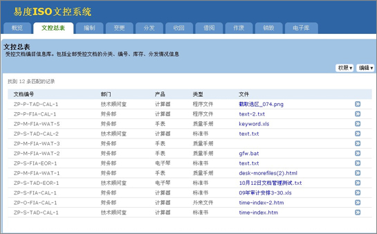
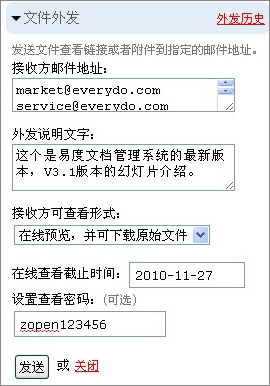
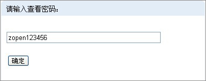
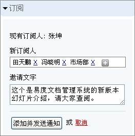
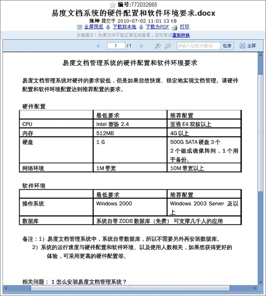

==================================
易度文档管理系统V3.1.2正式发布
==================================

经过紧张的9月功能开发和修改完善，易度文档管理系统迎来一个新的阶段，增加适
合于客户需求的功能，最大限度地改善用户体验，这个是易度团队一直在追求的。
从3.0版本到3.1版本，到现在这个修订的v3.1.2版本，易度文档管理系统一直在稳
定地前进。

以下是该版本的更新清单：

  1.新功能：增加ISO文控系统的安装

  2.新功能：文件外发，可匿名访问系统外发的文档

  3.新功能：邀请其他人查看文档

  4.功能增强：高保真、精确的常用文件查看

  5.功能增强：支持双层PDF的全文检索

  6.修正bug：易度控制台邮箱设置错误

  7.修正bug：大文件无法预览

详细的版本升级说明如下：

1. 新功能：增加ISO文控系统的安装
===================================
系统从通用的文档管理功能，曾强至ISO文控的管理功能。从文档的编制、变更、
分发、收回、销毁到遗失损毁、归档等。管理文档的全生命周期。详细了解ISO文控请
查看:  http://edodocs.com/solutions/isodoc.rst

2. 新功能：文件外发，可匿名访问系统外发的文档
===============================================
系统提供文件外发的功能，对于外发的文件可设置文档查看的期限、文档的使用权限、
以及访问密码等。接收人员无需使用帐号密码即可查看外发的文档

发送文件外发通知消息，设置查看方式权限和查看日期、密码等

消息接收人通过邮箱链接，以及所提供的密码进入访问

匿名查看该文件的信息

.. image:: img/v3.1.2_3.jpg

3. 新功能：邀请其他人查看文档
===================================
系统提供文档分享的新功能，可以通过邀请通知，把文件分享给其他同事。增强了企
业的知识管理

4. 功能增强：高保真、精确的常用文件查看
=========================================
系统通过使用openoffice开源产品的转换技术，可以清晰、精确地转换出以下格式的文
档：doc、ppt、docx、pptx、pdf、wps、dps等。采用openoffice的转换，除了可以增
强预览外，还解决了大文件预览的问题

5. 功能增强：支持双层PDF的全文检索
===================================

6. 修正bug：易度控制台邮箱设置错误
====================================

7. 修正bug：大文件无法预览
====================================
