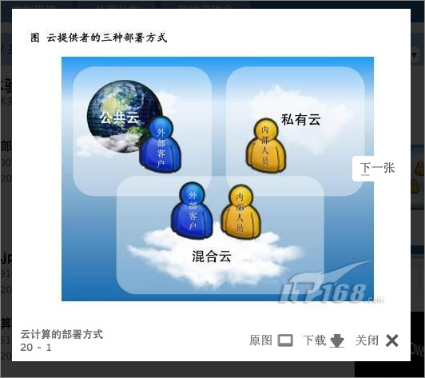
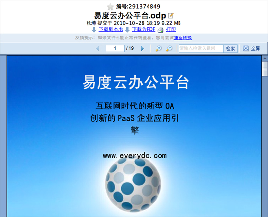
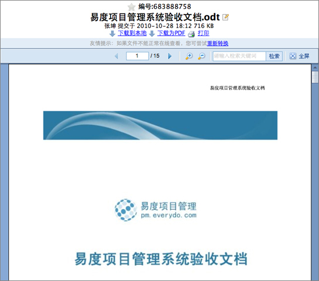
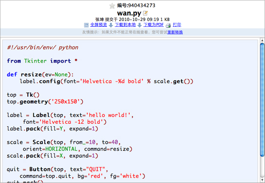
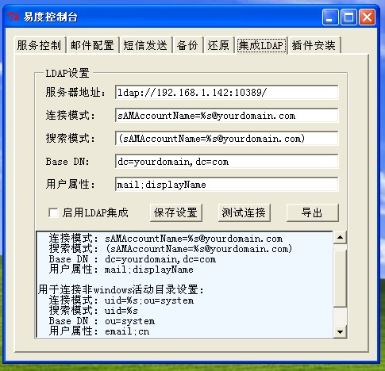
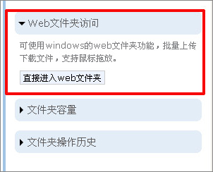
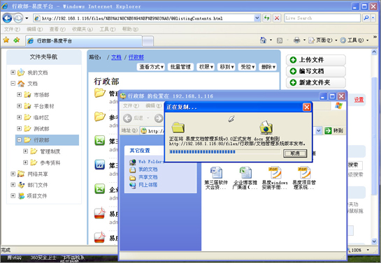
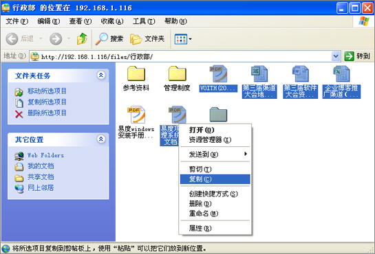
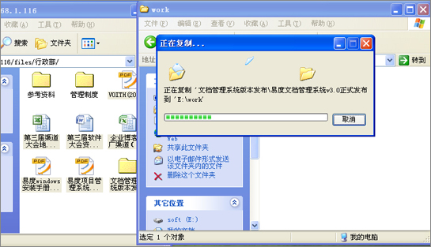

=============================
易度文档管理系统V3.2正式发布
=============================

2010年10月26日星期四，易度文档管理系统又做了一次升级。从原来的3.1版本升
级到现在的V3.2正式版本。在这次升级中，除了修正原有程序错误外，还新增了
很多功能，调整了设计，优化相关便捷的功能，同时，还在登录集成、AD\LDAP集
成方面做了规范的接口开发和设计。易度文档管理系统正在不断更新完善、稳定发
展。

以下是该版本更新清单：

1.新功能：相册型的图片浏览。

2.新功能：系统会自动关联标签相同的文件。

3.新功能：支持openoffice\代码格式的文件直接在线查看。

4.新功能：支持标准cas单点登录协议。

5.新功能：支持标准的AD\LDAP登录集成。

6.功能优化：通过IE下的Web文件夹可实现批量上传和下载。

7.功能优化：文件版本比较交互设计优化。

8.功能优化：文件夹和文档重命名的修改操作直接显示。

9.功能优化：图片的全屏预览可以预览到原图。

10.修正bug：账户管理中使用时间显示错误。

11.修正bug：不可以删除订阅人。

详细的版本升级说明如下：

1.新功能:相册型的图片浏览
===========================
在最近更新和摘要清单的查看视图的时候，可以通过易度提供的lightbox功能对图
片实现相册型的浏览查看。

2.新功能：系统会自动关联标签相同的文件
========================================
对于在相同文件夹下的文件，如果有相同的标签，就会自动关联起来。

.. image:: img/v3.2_1.jpg

3.新功能：支持openoffice\代码格式的文件直接在线查看
=======================================================
支持格式为openoffice格式文件.odt,ods,odp,ott,ots,otp的文档和程序代码格式
文档：.java,.c,.cpp,.jsp,.asp,.py,.as,.h的在线查看。

Odp格式文件在线查看：

Odt格式文件在线查看：

Py格式文件在线查看：

4.新功能：支持标准cas单点登录协议
======================================
支持标准cas单点登录协议，可以与其他的系统进行很轻松的单点登录集成

5.新功能：支持标准的AD/LDAP登录集成
=====================================
支持标准的AD/LDAP登录集成，可以直接把已有的用户名和密码直接导到易度系统

6.功能优化：通过IE下的web文件夹可实现批量上传和下载
=========================================================
实现文档和文件夹的批量上传和下载，可通过类似windows系统中的拖放操作和右
键操作。

实现批量上传：

实现批量下载：

7.功能优化：文件版本比较交互设计优化。
========================================

8.功能优化：文件夹和文档重命名的修改操作直接显示。
===================================================

9.功能优化：图片的全屏预览可以预览到原图。
===============================================

10.修正bug：账户管理中使用时间显示错误。
==========================================

11.修正bug：不可以删除订阅人。
=================================

