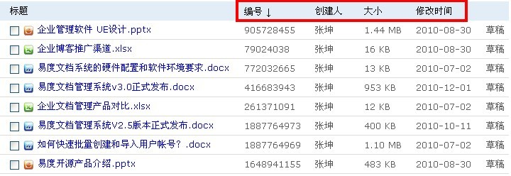

============================
易度文档管理系统V3.3正式发布
=============================

2010年12月1日，易度文档管理系统v3.3版本正式发布了，这次的版本升级主要
是从人性化的角度着眼，包括组织标识的设置展示、批量下载的功能、文件排序
以及同名检查等功能。都是把系统功能进一步细化，在个性化和操作简易性上不
断改善和优化。易度文档管理系统在产品稳定的基础上，会不断地新增功能以满
足各行各业客户对文档管理、内容管理的需求。

以下是该版本的更新清单：

1.新功能：支持组织标识和企业logo的设置。

2.新功能：实现多文件批量打包下载。

3.新功能：一般用户可对多个文件进行多选操作：下载、删除、移动复制等。

4.新功能：文件搜索结果可进行排序。

5.新功能：批量选择多个文件建立关联（不必输入编号）。

6.新功能：上传的文件支持同名检查。

7.功能优化：增加文件夹的信息：管理人和创建时间等。

8.功能优化：新的版本差异比较算法。

9.修正bug：部分文件压缩包不可预览。

10.修正bug：支持长文件名、长路径，支持长度达到3200个字符。

11.修正bug：文档概览中系统最近更新的文件显示所有文件库的文件

详细的版本升级说明如下：

1.新功能：支持组织标识和企业logo设置
======================================
可以在登录首页增加组织标识和企业logo，让系统更具个性化。

2.新功能：实现多文件批量打包下载
===================================
在文件列表页面，可以进行批量选择多个文件，然后把这些文件打包下载。
根据权限进行选择性下载。

3.新功能：一般用户可对多个文件进行多选操作：下载、删除、移动复制等
=====================================================================
在文件列表选了多个文件后，可以对多个文件进行删除、移动复制、修改状态、
合并PDF等。

4.新功能：文件搜索结果可进行排序
==================================
在文件夹的内容列表查看视图下，搜索后可按照编号、大小、修改时间等条件
进行排序。

5.新功能：批量选择多个文件建立关联（不必输入编号）
==================================================
在文件详细页面，可对选中的文件进行批量关联操作。

.. image:: img/v3.3_5.jpg

6.新功能：上传的文件支持同名检查
==================================
在同一个文件夹下，如果上传了相同名字的文件，系统会自动判断出来，而且
可以根据提示做以下操作：重命名、保存新版本、删除。

7.功能优化：增加文件夹的信息：管理人和创建时间等
=================================================
在文件夹的右侧栏，增加了相关的文件夹信息，包括当前文件夹的管理人，
创建人，创建时间等。

8.功能优化：新的版本差异比较算法
==================================

9.修正bug：部分文件压缩包不可预览
=====================================

10.修正bug：支持长文件名、长路径，支持长度达到3200个字符
==========================================================

11.修正bug：文档概览中系统最近更新的文件显示所有文件库的文件
==============================================================

