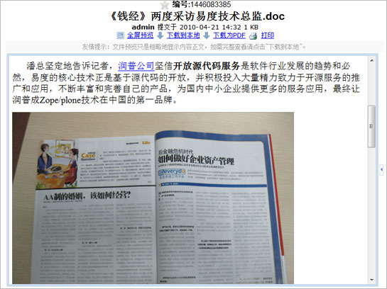
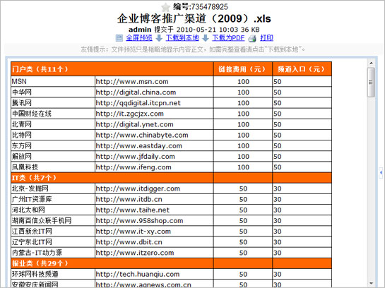
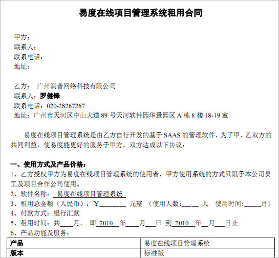
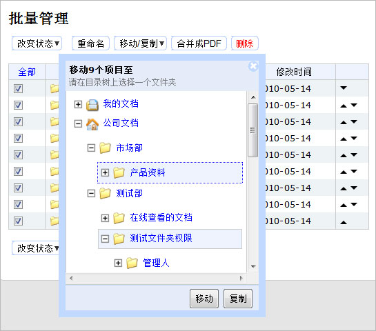
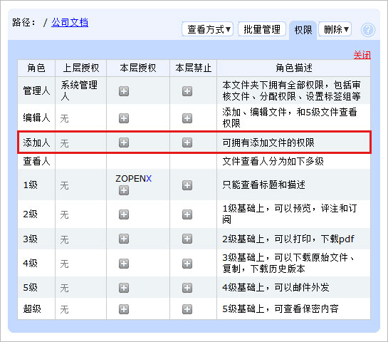

===================================
易度文档管理系统2.5版本正式发布！
===================================

经过多次的测试修改、不断的完善，近日易度文档管理系统2.5版本正式发布，2.5版本除了增加几个功能让系统更加完善以外，还修正了一些程序错误。 2.5版本是版本2的最后一个版本，易度将直接进入V3.0的版本开发中，届时将为大家提供更多个性化的功能，全面解决文档管理中存在的问题。

以下是V2.5版本的更新清单：

1.新增功能：采用oppenoffcie进行转换，增强office2003预览效果

2.新增功能：多个文档合并为PDF，支持页码排序

3.新增功能：支持文件夹批量移动

4.功能改善：权限中的协作人修改为添加人

5.修改bug：文件批量重命名

6.修改bug：空白的文件下载报错

7.修改bug：在windows server 2000下，扫描仪与系统不可以集成

8.修改bug：批量添加人员没有勾选邮件通知也会发邮件

9.修改bug：评注上传附件的权限

1.新增功能：采用oppenoffcie进行转换，增强office2003预览效果
------------------------------------------------------------------
通过安装免费的openoffice文档编写和转换工具，实现了office2003的文档细致转换。

2.新增功能：多个文档合并为PDF，支持页码排序
------------------------------------------------------------------
可以把多个文档或者图片合并成一个PDF，在合并过程中可以做排序处理。

3.新增功能：支持文件夹批量移动
------------------------------------------------------------------
通过批量管理的功能，可以把多个文件夹转移到别的目录。

4.功能改善：权限中的协作人修改为添加人
------------------------------------------------------------------
原来协作人是组合权限，现在协作人修改为添加人，只控制添加权限。

**5.修改bug：文件批量重命名**

**6.修改bug：空白的文件下载报错**

**7.修改bug：在windows server 2000下，扫描仪与系统不可以集成**

**8.修改bug：批量添加人员没有勾选邮件通知也会发邮件**

**9.修改bug：评注上传附件的权限**
