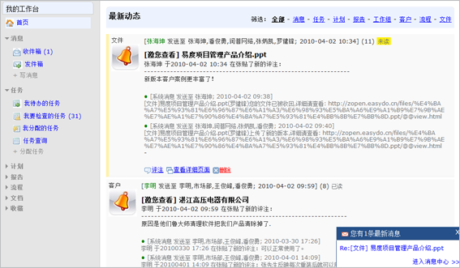
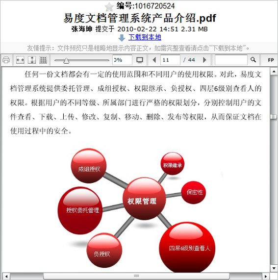
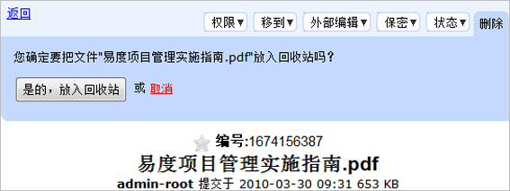

=====================================
易度企业文档管理系统V2.4正式发布
=====================================

易度企业文档管理系统V2.4于近日正式发布。新版本无论是从功能还是从易用性角度较之以前的版本都有了质的飞跃。v2.4是易度企业文档管理系统的一个新里程碑，易度也将一如既往的在文档管理领域继续创新和发展。

以下是v2.4版本的更新清单:

 1 新增功能：我的工作台，每个用户拥有自己独立的办公空间。

 2 功能改善：上传视频文件，会自动转换为FLV格式，不再需要安装任何插件了。

 3 功能改善：使用flash来预览PDF文件，支持全屏预览和缩略预览。
    
 4 功能改善：使用ajax形式进行文档和文件夹删除。

 5 修正bug: 文件夹权限禁止继承显示错误。

 6 修正bug: 文件下载为PDF文档后,显示的文字为乱码。

 7 修正bug: web文件夹批量上传和下载报错。

v2.4版本可让你的企业拥有twitter、优酷、豆丁的功能,具体如下：

**1. 新增功能：我的工作台，每个用户拥有自己独立的办公空间。**

   新的个人工作台，采纳了最新社会化企业的概念，订阅即关注，提供了事件流的消息阅读界面。

**2. 功能改善：上传视频文件，会自动转换为FLV格式，不再需要安装任何插件了。**

   上传视频，自动转换为flv格式，直接用flash播放，无需安装任何其他插件！音频也会自动转换为mp3格式。

**3. 功能改善：使用flash来预览PDF文件，支持全屏预览和缩略预览。**

    PDF文件转换为flash来阅读/播放，实现pdf阅读的最佳效果！

**4. 功能改善：使用ajax形式进行文档和文件夹删除。**

    使用ajax 不刷新页面的交互形式来进行文件夹和文档的删除，有效防止删除文档误操作。

**5. 修正bug: 文件夹权限禁止继承显示错误。**

**6. 修正bug: 文件下载为PDF文档后,显示的文字为乱码。**

**7. 修正bug: web文件夹批量上传和下载报错。**

