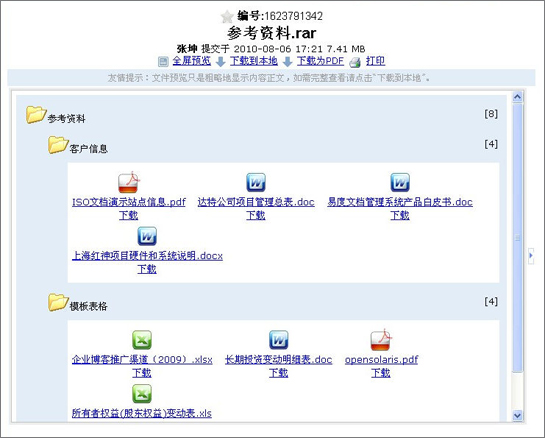
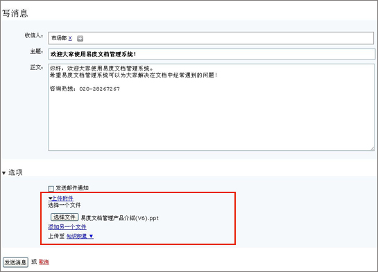
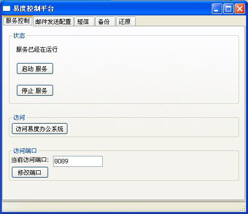
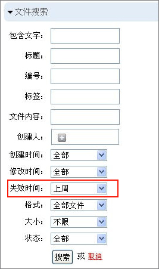
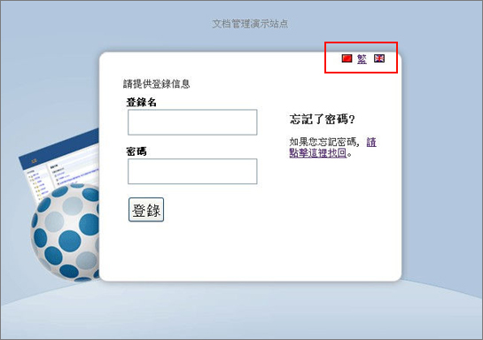
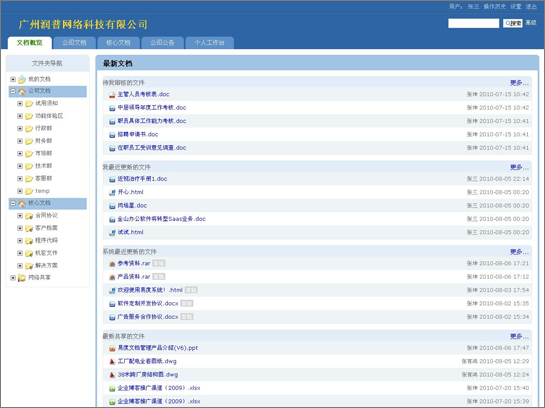
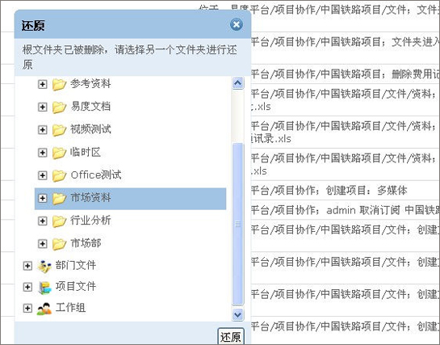
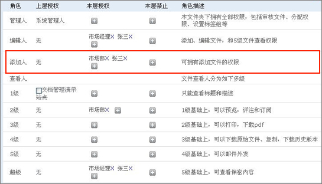

===================================
易度文档管理系统V3.0正式发布！
===================================

从V2.5.2版本到V3.0版本，对于易度文档管理系统来说，这是一个质的飞跃。不但在
功能上、在界面上，还是在性能负载、定制开发、服务拓展等多方面都做了一次大的
调整和升级处理。

以下是V3.0版本的更新清单：

  1. 新功能：可实现个性定制开发
  2. 新功能：增加了对压缩包的预览
  3. 新功能：在消息中心，写消息可附带附件
  4. 新功能：增加了易度控制台，全面控制系统的各个参数，方便系统人员进行维护
  5. 新功能：可根据文档的失效时间进行查找搜索
  6. 新功能：增加繁体中文版本
  7. 优化：还原文件夹和文件交互优化，增加还原位置选择
  8. 优化：去除协作人的组合权限，分解为添加人和2级查看人权限，更加细腻地控制权限 
  9. 优化：不管在界面和交互上都做了大量的美化设计
  10. 修正bug：不可以跨区移动文档
  11. 修正bug：在岗位上添加人员不可以添加至该岗位
  12. 修正bug：文件版本日期错误显示
  13. 修正bug:：消息转发不包含消息中的附件

1. 新功能：可实现个性定制开发
================================
可以自定增加文档库和修改文档库的展现形式。

2. 新功能：增加了对压缩包的预览
================================
可以对压缩包文件：rar、zip、tar、tgz进行直接预览而无需安装任何插件

3. 新功能：在消息中心，写消息可附带附件
============================================
在我的工作台中，写消息时可以添加附件，这个就像邮件系统一样使用。

4. 新功能：增加了易度控制台，全面控制系统的各个参数，方便系统人员进行维护
=================================================================================
通过易度的控制台，可以全面控制系统的参数，包括系统的启动、停止、系统端口的调整、
邮件服务器的配置等。

5. 新功能：可根据文档的失效时间进行查找搜索
====================================================
在文档搜索时，可以通过文档的失效时间把所有处于失效期的文档找出来，更加方便管理。

6. 新功能：增加繁体中文版本
===============================
特别为台湾、香港等使用用户增加了繁体中文的版本。

7. 优化：不管在界面和交互上都做了大量的美化设计
=====================================================
让大家在视觉和交互体验上得到最棒的体验。

8. 优化：还原文件夹和文件交互优化，增加还原位置选择
=====================================================
在文件被删除，文件夹也被删除的情况，可以通过还原功能，把文件还原到其他的文件夹目

9. 优化：去除协作人的组合权限，分解为添加人和2级查看人权限，更加细腻地控制权限 
==================================================================================
添加人的角色只是控制在该文件夹添加文档的操作。

10. 修正bug：不可以跨区移动文档
=======================================

11. 修正bug：在岗位上添加人员不可以添加至该岗位
===================================================

12. 修正bug：文件版本日期错误显示
=======================================

13. 修正bug:：消息转发不包含消息中的附件
============================================

