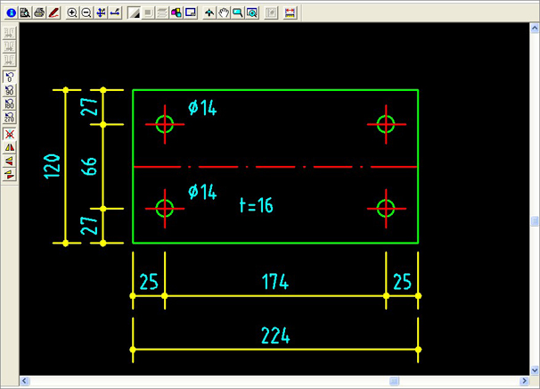
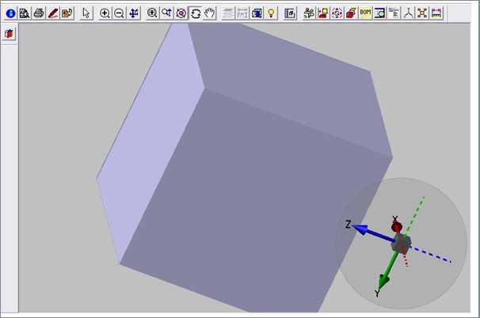
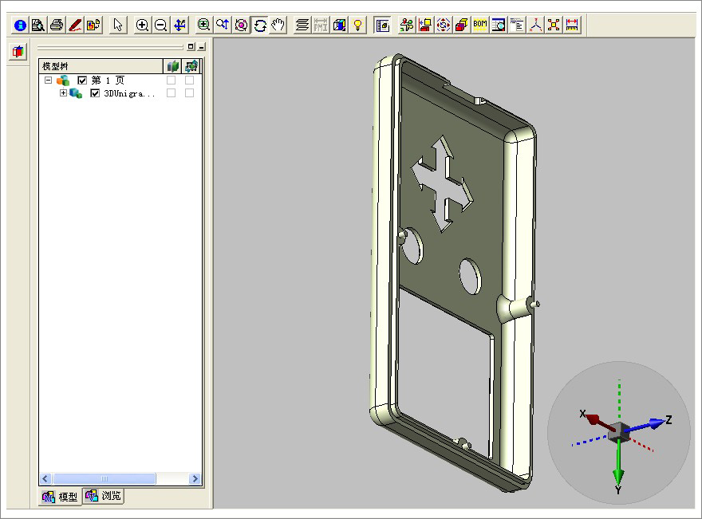
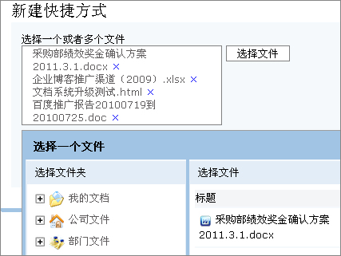
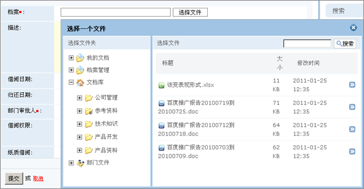
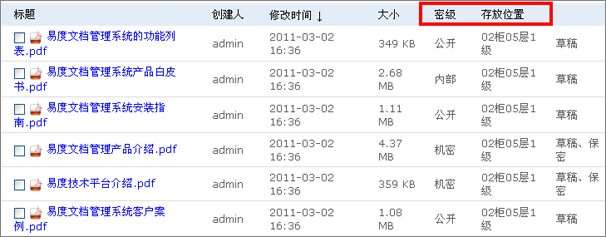
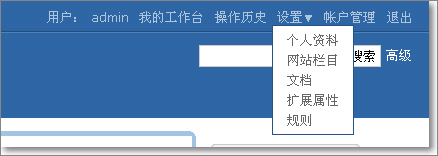

================================
易度文档管理系统V4.1正式发布
================================

2011年3月1日，易度文档管理系统V4.1正式发布了，在经历和寒冷的冬天和热闹的春节
后，易度文档管理系统又在性能、功能和体验设计上做了大量的程序优化工作。 让V4
系列的版本更稳定、更易用、更加贴近用户。在版本更新和版本完善的
过程中，有很多正式使用和试用体验的客户给予了我们很多的建议，在这里非常感谢大
家对易度的支持。

以下是该版本的更新清单：

1 新功能： 增加2D/3D格式图纸的在线预览

2 新功能： 可批量创建文档的快捷方式

3 新功能： 采用类似windows资源管理器的形式选择、调用文档

4 新功能： 可自定义列表的显示栏

5 功能改善：改善下拉按钮交互模式，需要进行点击后才出现选择面板

6 功能改善：我的工作台中，消息和最新动态合并, 最新动态显示全部消息

7 修正bug：win7下无法进行web文件夹访问的操作

8 修正bug：文档不可以打印全部

9 修正bug：office文档转换后不清晰

10 修正 bug：批量用户导入（英文样式）导入出错

11 修正 bug：邮件发信人为None

12 修正 bug：压缩包内的内容不能下载

13 修正 bug：部分中文没有彻底转换为英文（英文国际化）

14 修正 bug：ZIP压缩包不可以预览

15 修正 bug：公告论坛中的附件上传不了

详细的升级说明如下：

**1 新功能： 增加2D/3D格式图纸的在线预览**

易度现在支持几十种的2D/3D图纸在线直接预览，在预览前需要先安装易度3D预览控件
和AutoVue SolidModel 插件。

支持格式如下：

Pro/ENGINEER: PRT 、CALCOMP: PLT、 Protel: PCB、 IIIustrator: AI、Unigraphics: PRT
catia/cati5: CATPart、Inventor: IAM、SolidEdge: ASM, ASM、SolidWorks: SLDASM, SLDPRT
EDA: PCB,SCH等。

AI 截图:

CAD 截图:

ProE 截图:

**2 新功能： 可批量创建文档的快捷方式**

通过快捷方式可实现文档的重用，减轻文档存储的资源负担，同时，对文档版本管理
实现可控制、可维护、保证了唯一性。

**3 新功能： 采用类似windows资源管理器的形式选择、调用文档**

可以很方便地选择一个或者多个文档，在选择文档时，支持文档全文检索的功能。

**4 新功能： 可自定义列表的显示栏**

在目录内容列表视图的时候，可自定义显示的列表内容。包括编号、所处位置、金额
等元数据信息

**5 功能改善：改善下拉按钮交互模式，需要进行点击后才出现选择面板。**

实现了更好对手机、ipad等触摸终端友好。

**6 功能改善：我的工作台中，消息和最新动态合并, 最新动态显示全部消息**

合并了两个栏目，减轻了客户在使用上的理解负担。

**7 修正bug：win7下无法进行web文件夹访问的操作**

Win7已经可以正常使用web文件夹的功能了，在使用前请先下载兼容补丁。按照帮助的操作进行设置。

**8 修正bug：文档不可以打印全部**

可以直接打印文档的正文内容，选定页码等。

**9 修正bug：office文档转换后不清晰**

实现了文档的高保真的预览。

**10 修正 bug：批量用户导入（英文样式）导入出错**

**11 修正 bug：邮件发信人为None**

**12 修正 bug：压缩包内的内容不能下载**

**13 修正 bug：部分中文没有彻底转换为英文（英文国际化）**

**14 修正 bug：ZIP压缩包不可以预览**

**15 修正 bug：公告论坛中的附件上传不了**

