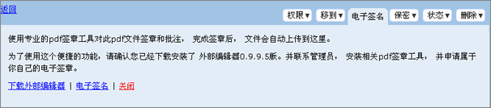
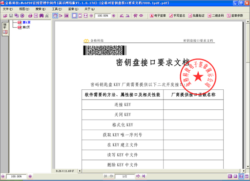
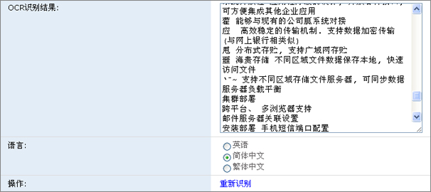
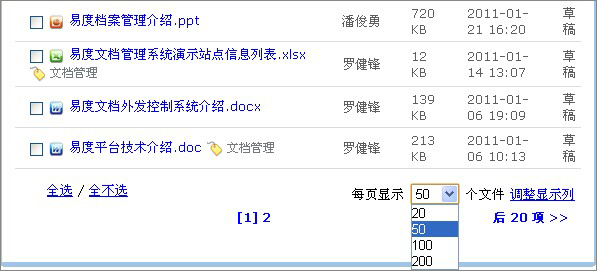
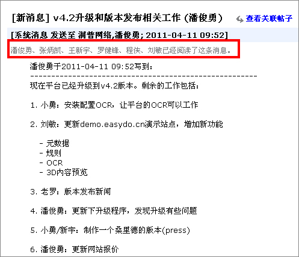
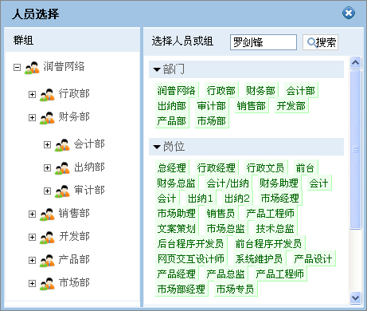
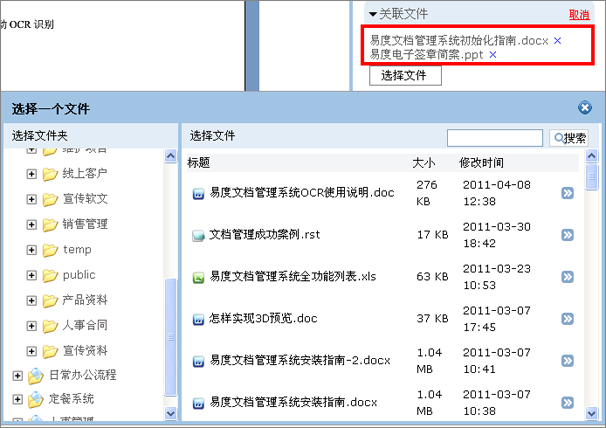
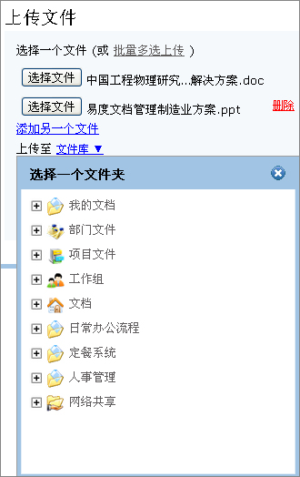

================================
易度文档管理系统V4.2正式发布
================================

2011年4月11日，易度文档管理系统V4.2正式发布了，该版本主要响应客户在事务性处
理的需求上，包括文档电子签章、扫描件的OCR识别、缩略图预览、直接生成PDF附件
等，同时，还考虑了大量用户使用的支持、海量文档的展示支持等。易度文档管理系统
在响应客户需求和建议以及知识管理理念的基础上进行功能强化。

以下是该版本的更新清单：

1 新功能： 增加文件夹的缩略图查看方式

2 新功能： 可对PDF文档进行电子签章

3 新功能： 支持扫描件OCR文字识别，识别后可进行全文检索

4 新功能： 可调整文件列表的显示文件数量，支持视图记忆功能

5 新功能： office文档和图片可直接生成PDF文档存放在文档附件列表中 

6 新功能： 可查看消息已阅读的人员名单

7 功能改善：支持大量用户选择，通过多层目录结构选择实现

8 功能改善：文件的关联，直接可选择文件，不再使用文件编号输入方式

9 功能改善：我的工作台里面上传文件，选择上传位置的时候，能够上传到任何文件夹
，而不仅仅是个人的文件夹

10 功能改善：去除上传多个文件时建立文件关联的选项

11 修正bug：不可预览的文档不可添加元数据（扩展属性）

12 修正bug：评注通知不可以发送到邮箱

13 修正bug：附件链接重复在消息通知中出现

详细的升级说明如下：

**1 新功能： 增加文件夹的缩略图查看方式**

系统增加新的查看方式：缩略图预览，这个功能主要针对图片，可很方便查阅文档夹中
的所有图片的信息。

**2 新功能： 可对PDF文档进行电子签章**

系统可与电子签章工具紧密集成，直接在PDF文档上进行电子签章，签章后可直接保存
至服务器中。

|

**3 新功能： 支持扫描件OCR文字识别，识别后可进行全文检索**

系统支持对扫描件进行自动OCR文字识别，对于识别后的文字结果可以进行调整和修改
，可根据识别后的结果进行全文检索，便于扫描件的检索。

**4 新功能： 可调整文件列表的显示文件数量，支持视图记忆功能**

系统支持海量文件的列表显示，可根据实际需要显示文档的个数:20 30 50 100. 同时
，可根据文档编号、文件大小、修改时间进行排序。显示个数和排序结果的视图支持记
忆功能。

**5 新功能： office文档和图片可直接生成PDF文档存放在文档附件列表中**

可把office文档和图片等直接生成附件PDF文档以便于事务性处理。

.. image:: img/v4.2-006.jpg

**6 新功能： 可查看消息已阅读的人员名单**

发送过的消息，可以查看被谁阅读过，谁还没有阅读

**7 功能改善：支持大量用户选择，通过多层目录结构选择实现**

改善人员选择的交互方式，支持多层次的目录结构选择，方便大量用户的选择

**8 功能改善：文件的关联，直接可选择文件，不再使用文件编号输入方式**

通过文档选择，进行直接的文件关联

**9 功能改善：我的工作台里面上传文件，选择上传位置的时候，能够上传到任何文件
夹，而不仅仅是个人的文件夹**

**10 功能改善：去除上传多个文件时建立文件关联的选项**

简化批量文档上传的流程，改善其用户体验

**11 修正bug：不可预览的文档不可添加元数据（扩展属性）**

**12 修正bug：评注通知不可以发送到邮箱**

**13 修正bug：附件链接重复在消息通知中出现**

