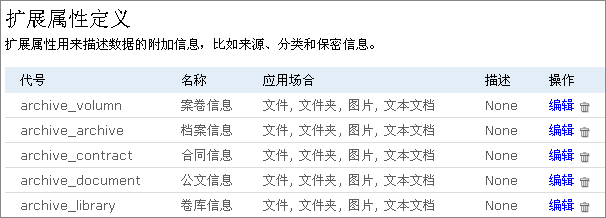
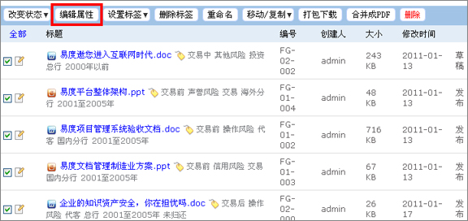
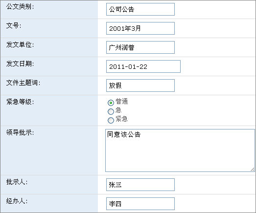
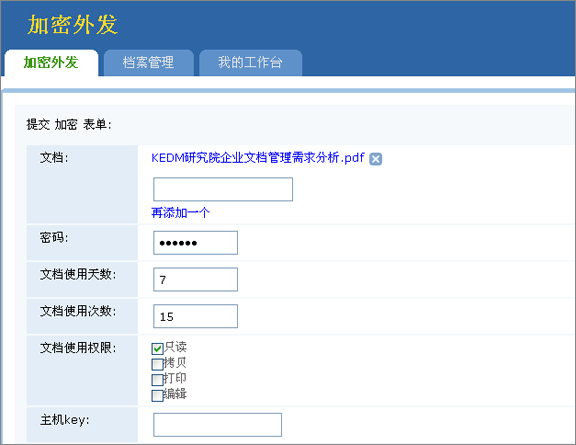
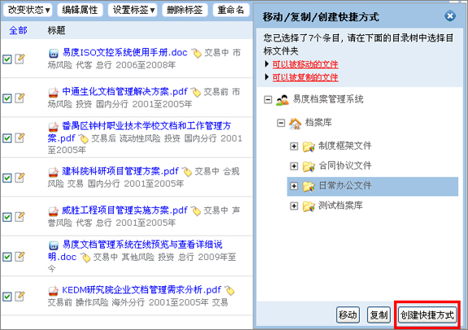
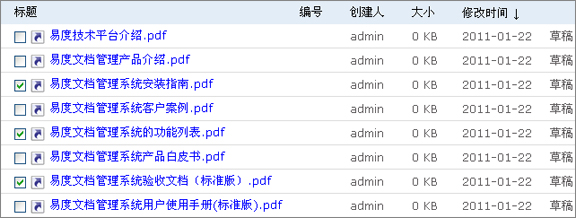
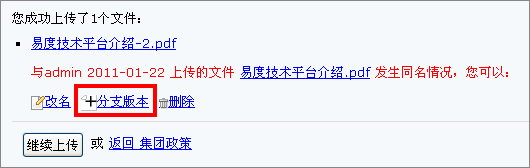

================================
易度文档管理系统V4.0正式发布！
================================

历时2个月的时间，易度文档管理系统终于跨越了V3.3的门槛，实现了质的飞跃。
V4.0是一个全新的体验版本，是一个可实现各行各业定制性要求的版本。
无论团队、公司、政府、学校、还是集团企业，都可以在易度文档管理系统中找
到一个很好的杠杆，让组织实现文档的信息化管理。

易度文档管理系统V4.0版本，是一个可以满足客户多样化需求的版本，而且后续
的功能也会更加的强大。 

以下是该版本的更新清单：

1 新功能：支持自定义元数据（扩展属性）。

2 新功能：批量元数据更改（扩展属性）。

3 新功能：发布档案管理系统，向内容管理深度领域扩展。

4 新功能：实现文档外发控制，实现文档安全、保密、防止泄密。

5 新功能：海量文件高速批量自动导入工具。

6 新功能：实现文档快捷方式功能，可让同一个文档出现在多个文件夹目录中。

7 新功能：实现系统或文件夹规则引擎。

8 功能增强：海量文件存储、管理支持。

9 功能增强：实现文档管理系统的全英文化。

10 功能增强：自动创建文档的分支版本。

11 修复bug: 超长文件名不支持的问题

12 修复bug : temp 目录的临时文件未清除的问题

13 修复bug : 受控文件夹的权限错误。

详细版本升级说明如下：

1 新功能：支持自定义元数据（扩展属性）
++++++++++++++++++++++++++++++++++++++++++
可以为库、文件夹、文档添加不同类型的元数据，让文档更容易分类、检索和
实现规范化管理。

2 新功能：批量元数据更改（扩展属性）。
++++++++++++++++++++++++++++++++++++++++++
批量上传多个文档后，可以批量编辑文档的元数据。

3 新功能：发布档案管理系统，向内容管理深度领域扩展。
+++++++++++++++++++++++++++++++++++++++++++++++++++++++++
使用易度档案管理系统，可很方便地按照政府、企业、学校的要求，集中管理好
电子档案和纸质档案。

4 新功能：实现文档外发控制，实现文档安全、保密、防止泄密。
++++++++++++++++++++++++++++++++++++++++++++++++++++++++++++
实现文档的加密外发，严防扩散。接收方需要通过密码才可以打开，同时，严格
控制文档打开的时间、次数、权限等。

5 新功能：海量文件高速批量自动导入工具。
++++++++++++++++++++++++++++++++++++++++++++
对于TB级别以上的文件量，可以通过该自动导入工具实现快速、稳定、断点续传
式导入。

6 新功能：实现文档快捷方式功能
++++++++++++++++++++++++++++++++++++++
可让同一个文档出现在多个文件夹目录中。可减轻存储的负担和由于文档版本更新
而导致的错误发生。

7 新功能：实现系统或文件夹规则引擎。
++++++++++++++++++++++++++++++++++++++
可以为文件夹分配若干规则，包括补充元数据、状态的切换、自动编号规则等。

.. image:: img/v40_release8.jpeg

8 功能增强：实现文档管理系统的全英文化。
+++++++++++++++++++++++++++++++++++++++++++
系统由原来会存在中英混合的情况，逐渐实现全英文化的界面。

.. image:: img/v40_release9.jpeg

9 功能增强：自动创建文档的分支版本。
+++++++++++++++++++++++++++++++++++++++++++
对于已经分布的文档，如果再次上传新的文档版本，会自动建立分支版本，待分
支版本审核发布后才自动覆盖原来的旧版本。降低由于版本更替导致的文档不连
续的负面影响

10 功能增强：海量文件存储、管理支持。
+++++++++++++++++++++++++++++++++++++++++++
真正实现了海量文件的存储和管理。而且不会减慢检索的速度。

11 修复bug: 超长文件名不支持的问题。
+++++++++++++++++++++++++++++++++++++++++++
现在可以支持3200字符的长文件名和路径。

12 修复bug : temp 目录的临时文件未清除的问题。
+++++++++++++++++++++++++++++++++++++++++++++++++
现在会把temp目录的临时文件清除，以释放更多的硬盘空间。

13修复bug : 受控文件夹的权限错误问题。
++++++++++++++++++++++++++++++++++++++++++++
修正了授权文件夹的权限错误问题。

