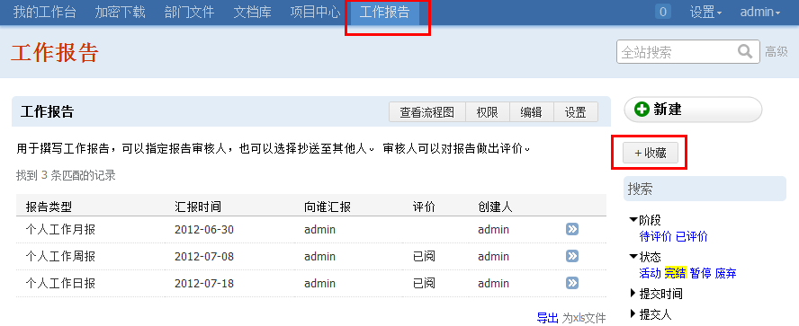

=================================
文档管理系统 V3.0.474 版正式发布
=================================

经过若干年的发展，易度已经变得非常庞大。

为了系统的持续发展，从这个版本开始，系统内核开始精简。一些内核的应用，会逐步迁移为扩展应用。

这个版本中，个人工作台的工作报告，将迁移一个独立工作报告流程中。所有历史数据将保留。

您可以点击上方的收藏按钮，这样可以继续在个人工作台上的“待办事项”中继续报告:

.. image:: img/v475-desk-report.png
   :width: 600

另外，本版本修改了部分故障，加强了系统的稳定性。

#. 文件夹名称过长导致显示的问题
#. 文件夹创建人，在web文件夹中，不能上传文件夹
#. 改进excel转换的稳定性
#. 文档模板可继承上层的设置
#. 个人网盘增加容量限额显示
#. 改进消息发送的稳定性
