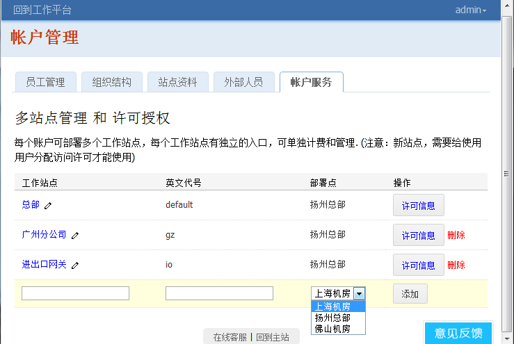

这个版本开始，易度能够支持更加复杂的部署场景，更适合大型和多种需求的客户使用。

多站点部署
================
易度越来越成为一个多功能的全面工作平台，易度正被更多大集团公司所使用，甚至跨国公司。这要求易度能支持更复杂的部署场景。

这个版本开始，易度能够支持多站点、多部署地的架构:

也就是一个账户，可以部署多个站点，可在授权站点之间自由切换:

这多个站点可部署在不同的物理位置，单独计费和授权, 单独进行防泄密控制. 

**注意：因为多站点支持，所有网站地址发生变化，会在网址上加一个default路径.** 比如::

  http://xxx.easydo.cn/files

改为::

  http://xxx.easydo.cn/default/files

其他改进点
===================

- 文件夹模板功能

  重复创建文件夹结构，重复设置权限？现在易度新推出文件夹模板的功能，只需设置好模板文件夹，就可自动创建了。

  .. image:: img/v48-folder-template.png
     :width: 600

- 增强分享功能

  支持文件夹分享，文件批量分享

  .. image:: img/v48-multi-share.png
     :width: 600

- 编写文档的时候，如果页面刷新或者跳转，会提示用户是否保存文档，避免编写的文档丢失。

- 外部编辑器升级

  新版本编辑文档更稳定，编辑的文件不会因为异常情况丢失，推荐从前的用户升级外部编辑器。

  新版外部编辑器会将下载编辑的文档会存放到 ``我的文档\edoeditor`` 中，不会删除，这样即便发生异常，也可以在这里找到之前编辑的文档.

- 搜索结果的批量操作
- 文件夹管理人禁用功能，限制为只能禁止系统管理员
- 易度控制台，改为纯web版本的
- 文件摘要查看方式，显示最新的修改人
- 如果隐藏个人工作台，放入右上角的个人下拉菜单。
- bugfix: 视频播放在IE浏览器上只显示1/3
- BUGFIX: 更好的文档转换效果，使用微软office组件进行转换

