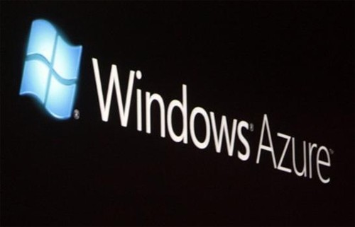
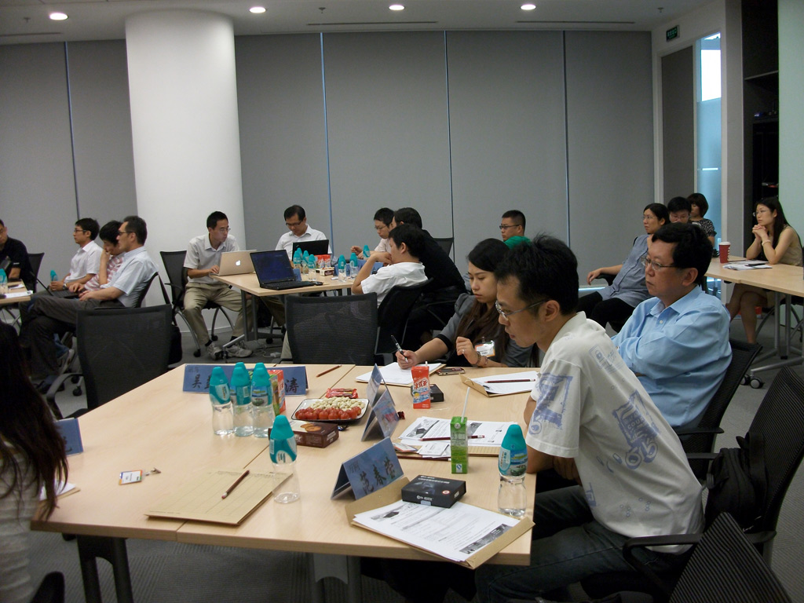
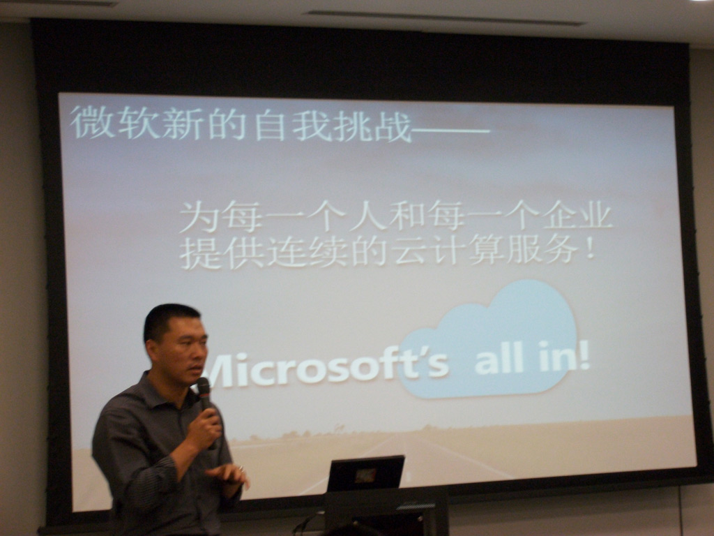
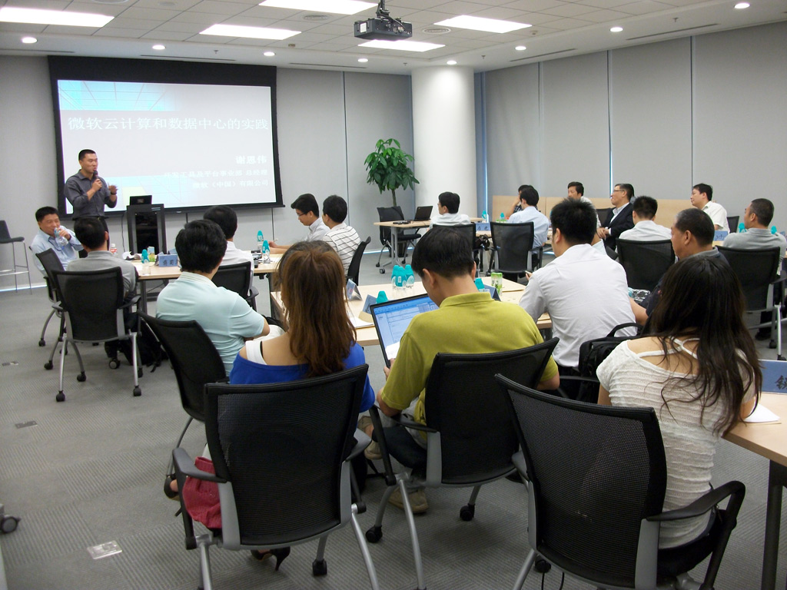
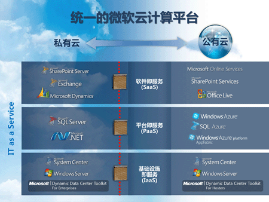

===========================
易度参加微软云计算研讨会
===========================

8月18号，在互联网大会召开的同时，易度应邀参加了微软
的云计算战略研讨会。

参加会议的都是国内云计算实践者和先导者公司：易度云办
公，用友伟库，云快线，百会，xtools，800客，亿企通等等。

微软提出了最新的口号"we're all in clouds",表明微软未来
重点在云计算的决心。微软阐述了在云计算方向的战略规划和
合作伙伴的策略，同时也演示了合作伙伴开发并正在提供的一
些云服务。

会上大家探讨了国内saas的挑战与机遇，并对中国市场充满了
期望。

|

|

|

|

