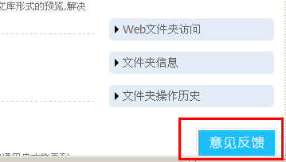

==============================
集思广益，开通用户反馈的渠道
==============================

随着公司的发展壮大，越来越多的企业认可并使用云办公系列软件。同时，软件系统也将更加成熟稳定，功能应用会更加全面。

易度团队为了使产品能够更好地满足用户群体的需求，通过集馈网，开通了用户反馈渠道。收集每位员工，每个团队，每家企业的建议、问题、评价等。通过这样一种途径，加强与用户间的交流，通过相互的沟通讨论，发掘出更多更好的功能应用。

立即 `试用易度系统 <http://demo.oc.easydo.cn/@@loginForm.html?camefrom=%2Flogin%3Fservice%3Dhttp%253A%252F%252Fdemo.easydo.cn&isdocsdemo=1>`_ ，并提出宝贵意见！