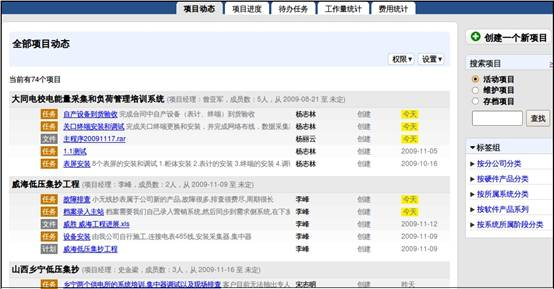
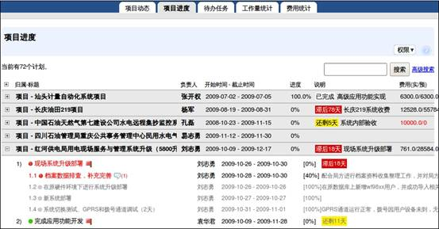
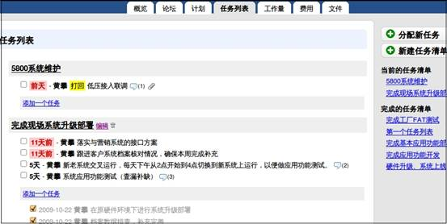

====================================================
易度项目管理平台新版本正式发布
====================================================

.. sectnum::

近期，易度项目管理平台新版本正式对外发布。

新版本是根据国内客户项目管理的实际情况，在老版本的基础上重新开发的一款软件。继承了经典版本的高效团队协作和易用性，同时增强了公司项目管理的严谨性。另外，新版的项目管理架构在整个易度工作平台的基础上和其他产品集成度更好，可以扩展易度的其他功能模块，也可通过API轻松集成其他业务系统中。总结起来，新版本是一款基于项目管理思想的、管理协作沟通融为一体的、可定制的具有行业特征性的、创新实用的在线项目管理软件。帮助企业解决项目团队异地协作的问题；实时监控、跟踪项目进度的问题；项目知识管理和项目知识重用等问题。
  
新版本功能特点介绍
====================================================

一目了然的项目动态
-------------------------------

* 项目动态显示全部项目最新动态，包括用户参与的项目，让用户及时了解项目最新进展情况。

多项目的并行管理
-------------------------------

* 新版本提供多项目的并行管理，项目首页提供有“项目动态”、“项目进度”、“待办任务”、“工作量统计”、“费用统计”模块，可跨项目的查看相关信息。
* 相比老版本，新版本可做到清晰了解所有项目的活动情况；可以实时监控、跟踪所有项目进度情况；可以实时了解项目成员任务完成情况；可以了解所有项目的人力资源状态；可以统计项目费用情况，量化项目成本。这些都增强了公司项目管理的严谨性。

.. image:: img/多项目.JPG

有效的项目进度监控
-------------------------------

* 相比老版本，新版本不仅可以监控项目进度和计划情况，而且可以监控里程碑任务情况及费用情况等。里程碑会自动报警，以警示颜色标识。

完备的项目管理空间
-------------------------------

* 每一个项目独立分配一个工作空间。每个项目工作空间中提供了一组创新实用的工具，包括概览、论坛、计划、任务列表、工作量、费用、文件等工具。

* 相比老版本，新版本继承了其高效的团队协作性和易用性，方便发布项目消息、管理项目计划和进度，同时方便分配、查询、管理任务，统计工作量和费用。还可以帮企业把项目知识资料沉淀下来，当下次做类似项目的时候，就可以调出项目资料，作为参考使用。

便捷易用的项目论坛和消息通知
----------------------------------------

* 相比老版本的“消息板”和“讨论区”沟通工具，新版本提供便捷易用的项目论坛和消息通知功能。
* 论坛消息分类存放，方便查阅历史沟通记录。同时可通过系统消息通知、邮件通知、短信通知等多种方式通知。

* 提供“我的消息”模块，系统的消息通知、评注通知、任务的分配下达通知等，都会及时通知到个人的“我的消息”中。

项目计划实时展现
-------------------------------

* 新版本为每个项目工作空间配备单独的“计划”工具，在这里项目经理可以创建企业的项目计划，管理人员可跨项目的了解项目计划进度完成情况，分析项目存在的问题。项目成员可以实时汇报自己的计划任务执行情况，反馈问题。
* 相比老版本中项目计划创建、发布和汇报的“里程碑”工具，新版本单独分配了“计划”工具。帮助项目经理有效监控项目计划，同时项目计划可逐层分解成任务，分配给项目成员，落实工作。可以设置任务等级、里程碑节点、任务检查点等。项目计划会自动报警（以警示颜色标识），表明项目滞后的、即将到来的里程碑 

.. image:: img/计划.jpg

使用任务列表，对各类问题进行跟踪
-----------------------------------------

* 新版本提供“任务列表”工具。在这里，可以对各类问题(突发性）进行跟踪。为不同类型的任务，分别建立任务清单（组织不同任务的容器）。通过任务的评注功能，可报告任务的执行情况。一旦问题处理完成，项目人员关闭任务即可。可直接在问题上报告工作量信息和费用发生情况，以便进行时间占用分析和项目费用分析。

项目工作量分析
-------------------------------

* 新版本可进行项目内和跨项目的工作量查询分析。
* 相比老版本的“工作日志”模块，新版本首页提供“工作量统计”模块，可以统计所有项目的工作量情况，方便管理者更合理的配置人力资源。提供筛选查询功能，可根据工作记录类型、人员等进行工作量查询统计，并可导出为excel格式。

* 每个项目工作空间中配有独立“工作量”工具，在这里，项目成员可以随时随地轻松提交工作量，项目经理可及时了解项目成员工作情况，进行审核确认，量化项目人力资源。

.. image:: img/工作量.jpg

项目费用和预算管理
-------------------------------

* 新版本根据客户项目管理的实际情况，新增了项目费用功能，可进行项目内和跨项目的项目费用统计。
* 首页提供“费用统计”模块，方便管理者统计所有项目的费用情况，量化项目成本。

* 每个项目工作空间中配有独立“费用”工具，在这里，项目成员可以轻松进行个人的项目费用预算申请和费用报销。项目经理可以轻松审批项目成员提交的费用预算申请和报销申请。

强大的文件管理
-------------------------------

* 新版本为每个项目工作空间分配独立分配“文件” 模块，不仅包含简单文档管理的一些功能，如上传文件、下载文件、共享文件、分类管理文件、评注和订阅文件等，还具有文件保密、文件版本管理和支持文件审核流程的强大功能。

.. image:: img/文件.jpg

项目的活动、维护、存档状态
-------------------------------

* 新版本支持切换项目状态功能。项目状态分为初始的活动状态，项目维护状态，项目存档状态。根据状态将项目分为活动项目、维护项目、存档项目。
* 项目进入维护状态，项目自动屏蔽项目组员操作权限，交付给维护人员维护。项目进入存档状态，项目中所有内容将自动存档，方便以后查阅

.. image:: img/项目状态.jpg

创新实用的项目标签组
-------------------------------

* 新版本提供创新实用的项目标签组功能，类似百度百科的开放分类，每个项目可设置多个分类标签。分组标签支持多维树状导航，分类更灵活。标签组可进行设置，为项目提供多角度的分类。

灵活的项目组自定义
-------------------------------

* 可自定义的设置项目组及方便的设置项目组员
* 可为项目组设置项目权限或项目中文件夹曾经文件的权限

强大易用的角色权限控制
-------------------------------

* 相比老版本，新版本提供更加强大易用的角色权限控制，包括全局权限控制，支持设置全局的全局项目管理人，创建项目人和全部项目查看人的角色。项目权限控制，支持设置当前项目的管理人、项目协作人及项目查看人的角色。还支持项目中文件夹包括文件的权限设置。

提供报表导出功能
-------------------------------

* 新版本提供报表导出功能，可把项目工作量、费用、项目进度、文档等导出，导出格式为csv文件，可使用excel打开。 

轻松的功能拓展
-------------------------------

* 新版的项目管理架构在整个易度工作平台的基础上和其他产品集成度更好，可以扩展易度的其他功能模块，例如：易度文档、易度流程、易度报告等。也可通过API轻松集成其他业务系统中。

完整的操作历史记录
-------------------------------

* 新版本提供完整的操作历史记录功能，所有项目中的操作(创建、编辑、版本、流程、等)都会保存在操作历史记录里，方便对项目操作进行监视，找出安全问题的原因。 

方便快捷的收藏功能
-------------------------------

* 新版本提供方便快捷的收藏夹功能，利用收藏夹可将项目中产生的有价值文档进行收藏。可对自己的收藏进行分类管理，在收藏夹里可对相关文档进行自定义标签，方便、快捷地进行定位。

使用情况和用户反馈
====================================================

易度项目管理平台新版本自正式发布前已经在线邀测半年多，新版本让众多用户耳目一新，同时深感功能上的强大，很多用户在正式收费使用。

典型案例是长沙威胜仪表集团。威胜集团是中国领先的能源计量设备、系统和服务的供应商，于2005年12月在香港主板上市，是中国首家在境外上市的能源计量与管理专业集团。集团总部在湖南长沙，全国各地设有分公司，工程项目遍布全国各地。大凡工程项目公司在工程项目实施的过程中都始终存在着项目成员沟通不畅、工作协同少、责任不明确，管理环节脱落，计划、任务分解传达不到位，费用预算与实际支出比例失调，监督难以到位，分公司与总部管理衔接不到位等等现象。因此，工程项目公司急需要一套专门的项目管理平台去解决多项目的人员沟通、协调、配合，项目进度的监测、跟踪，工程费用控制，项目时间管理等问题。我们开发的易度项目管理平台新版本完全能够解决上述的问题，迎合工程项目公司的需求。很好的解决了工程项目上计划的制定、任务的分解、成员的沟通配合、项目成员的工作监督、工程的费用预算与支出、项目文档处理等事项。同时还具备很多企业管理方面的其他强大功能。不仅是一个优秀的项目管理软件，而且还是一套先进的企业管理软件，正因为如此，威盛集团在众多的软件中选择了我们的产品，也充分的说明易度项目管理系统软件是目前最好、最适用的一套项目管理软件。 

平台版本目前的一些问题及未来发展 
====================================================

以上是易度项目管理平台新版本更新及改进的相关功能及用户使用情况，新版本着重突出项目的管理、协作及沟通，但也还存在一些问题。我们的技术人员也在不断改进。在项目管理方面，我们将会做的更加精细和全面，从项目的全局角度管理更加精细到具体人员的管理；在项目协作与沟通方面，我们也将会做得更开放，如会采取消息推送等多种开放形式的协作沟通手段。关于未来发展方向，我们将主要向行业性、针对性及定制性方面发展。针对各个行业，我们将提出项目管理的各个典型行业解决方案。针对各个公司，我们将根据公司实际情况及项目管理存在的问题，有针对性地提出解决方案及建议。并且我们会在可定制性方面进行进一步发展。在此，我们欢迎大家进行体验及将使用中遇到的问题和疑问及时反馈给我们，我们会在第一时间予以响应。打造高满意度、更好使用体验的产品是我们不变的追求。

如想体验易度项目管理平台新版本功能，请登录http://pm.everydo.com/。联系电话：020-38055596
