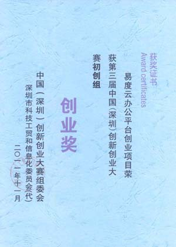

=============================
创业大赛落幕，易度获创业奖
=============================

中国深圳创新创业大赛圆满结束，易度云办公荣获创业奖。

创新创业大赛是国家科技部、发改委指导，由中国技术创业协会和深圳市人民政府联合主办的一项全国性创新创业大赛。大赛旨在弘扬创新创业文化，激发全社会对创新创业的热情，鼓励企业创新和团队创业。

创新创业大赛备受关注，所以报名的企业、团队也肯定不会少，经过了初选，易度云办公顺利进入到初赛阶段，并以63.33分的成绩成功晋级；在第二轮复赛中，易度的创新理念一致获得好评，71分闯进决赛；易度团队连日的准备，迎来了最后的决赛，并赢得创新创业大赛创业奖。

从初赛中的200多家企业团体参加比赛，到复赛筛选出40家，再到决赛的15家角逐，易度云办公赢得了大赛评委和大家的支持和认可。

易度总经理王俊峰被邀出席大赛颁奖会，并代表领取了深圳创业大赛初创组创业奖。

|

感谢大家的努力和支持，易度云办公会持续进步，推出更优质的产品和服务，打造新互联网办公时代！

`立即下载 <http://everydo.com/demo.rst>`_ 获奖作品