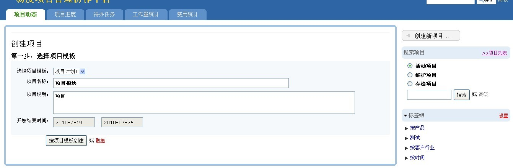
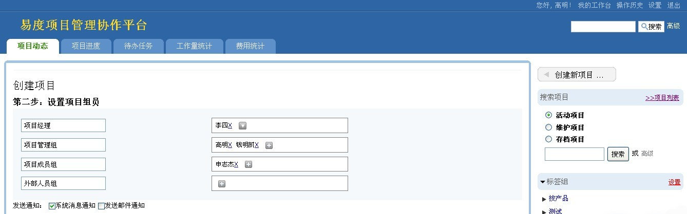
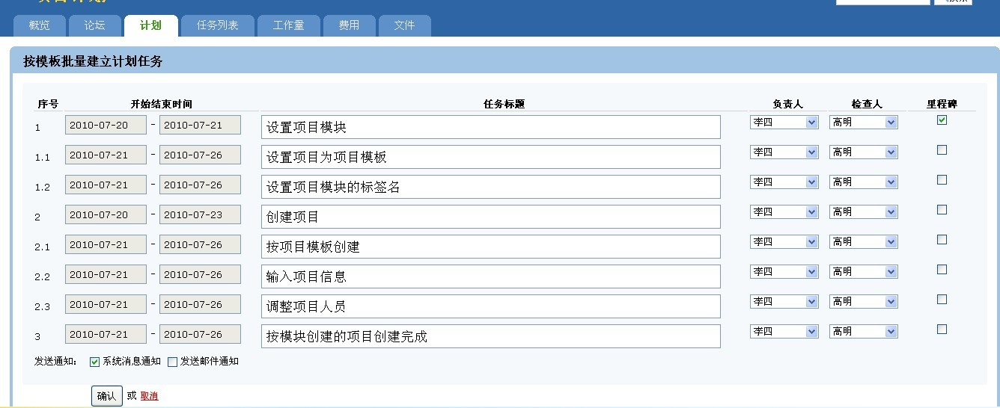

背景
================
- “我的项目中有一些同类型的项目，人员组及人员比较固定，而每次我新建项目后，要一次又一次的加这些组和人员”
- "我有一些同类型的项目，这些项目基本上都是固定的做这些事，现在每次建重复性的项目任务让我很痛苦"
- “我希望新建的项目能如“XXX项目”中设置的文件夹档目及设置好的各文件夹查看下载权限”

项目模板功能
==============
项目模板功能可指定某个或某些项目为项目模板，创建项目时可选择这些模板，以选择的项目做为模板原型克隆一个与模板定义的（同时你可以去调整的）项目人员组、项目权限设置、论坛分类、费用工作量分类、计划任务、和文件夹目录、包括文件夹、子文件的权限设置的项目。

也就是说，它可以帮助你完成这些工作：

- 按项目模板定义项目人员组
- 按项目模板定义项目权限设置
- 按项目模板定义论坛分类
- 按项目模板拟建好的计划
- 按项目模板工作量、费用分类
- 按项目模板定义项目文件区中的文件夹目录
- 按项目模板定义项目中文件夹及子文件夹的权限设置

项目模板功能步骤
======================
1. 设置项目为项目模板

   先进入一个项目，我们会看到上方有“设置为项目模板”的按钮，点击这个按钮如下图：

.. image:: img/1.jpg
   :width: 600px

2. 创建项目时，选择项目模板创建

   点项目全局页面右侧的“创建项目”，在点这个“按项目模板创建”如下图：

.. image:: img/2.jpg
   :width: 600px

3. 按模板创建第一步：输入项目标题等信息

   可选择已设定好的模板，输入项目标题、描述、开始结束时间

4. 按模板创建第二步：再调整项目人员组

   您可再调整从模板中克隆过来的项目组及人员

5. 按模板创建第三步：项目已创建，再调整平移后的计划任务

   这里从项目模板“预”克隆了整个项目计划，且根据项目开始时间平移的计划任务的开始结束时间，可再调整，取消保存即不保存计划。

6. 按模板创建的项目创建完成
 
   保存后，看到按项目模板创建了新的项目分解计划。同时，我们可再看到项目权限设置、论坛分类、工作量、费用分类、项目文件区中的文件夹目录、及文件夹子文件夹权限设置和模板中一样。

.. image:: img/6.jpg
   :width: 600px

