==================================================
易度淘宝记系列之 — 轻松进行项目费用管理
==================================================

.. Contents::
.. sectnum::

大家好，又到了新一期的淘宝记。本期要给大家晒的宝贝是易度项目管理系统的费用管理功能，包括费用预算、费用报销、费用考核、费用分析等。

企业的项目费用管理
=============================
企业的项目费用管理通常包括项目费用预算、项目人员费用报销、项目费用统计等，企业需要严格控制这些项目费用。项目费用的预支和结算需要严格走工作流程，项目费用需要能够进行统计分析，以作为量化项目成本。

相关人员
-----------------
项目费用管理过程涉及的三种项目角色：

工程项目人员
   工程项目实施过程是多方紧密配合完成的，项目涉及各部门人员调配，各工种互相配合。这些项目人员常常分散在全国各地，由于项目需要，经常需要出差，需要提前进行费用预算。

部门经理(或者项目的“管理人”)
   部门经理或者项目的“管理人”负责费用预算、费用控制、费用考核等，审核项目人员的费用支出，对项目人员的费用预算和费用报销进行审批。

财务人员
  财务人员对费用的分发进行控制和管理，负责项目费用的支出、核算、控制、预算和分析。

费用预算过程
----------------------

项目费用预算控制主要用于项目成员出于项目工作的目的。项目成员需要提前做出一定时期内的费用预支申请，包括差旅费、通讯费、工具费等项目费用，向部门经理或者项目的“管理人”提交费用申请，费用审批通过后，公司财务人员进行核对，发送预支资金，将相关的费用交付工程项目人员。

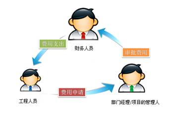

费用报销过程
----------------------

项目费用报销过程主要用于监控项目成员的项目的实际费用消耗情况。项目成员向部门经理或者项目的“管理人”提交费用报销申请，报销审批通过后，财务人员进行费用核对，对照项目人员的费用预算和实际消耗发生的实际费用明细，实现多退少补，便于财务进行费用风险控制。

.. image:: img/报销流程.jpg

存在的问题
====================================================

企业在项目费用管理方面通常存在以下问题：

* 项目费用操作流程复杂。一个复杂的项目通常受到地域距离方面的限制，导致项目人员分散在各地，传统的费用申请和报销流程难以实行。部门经理需要花很长时间处理各地项目人员的费用申请和报销数据，财务部门难以准确准备下个月的预算费用，导致费用预算不够全面、准确、细致。

* 没有有效的进行费用控制。由于没有建立一套完整、科学的费用核算体系，项目成员的实时费用消耗情况难以准确把控，致使费用消耗失控，费用升高，费用与财务不能实现一体化管理，难以对项目财务上的风险进行事先察觉和控制。 

* 没有对整个费用管理进行规划。由于缺乏一个科学合理的费用管理规划，包括：费用预算、费用报销、费用核算、费用控制、费用考核、费用分析，项目费用经常超支，不能及时、有效地采取策略对费用加强控制。
 

易度项目费用管理
=================================================

针对上述企业存在的问题，易度项目管理系统为项目提供了费用管理功能，包括费用预算、考核和分析等，量化项目成本。在“费用统计”模块可跨项目的统计所有项目的费用情况，可进行费用调整和确认。在每个项目工作空间中，易度项目管理平台提供了“费用” 模块，统计具体项目的个人费用情况，加强费用的控制，建立更稳妥、更简单的财务预算，减少公司财务风险。

我们可为企业做到：

* 进行项目内和跨项目的项目费用统计
* 每个项目成员可以申报每月的各类费用计划
* 项目成员可以报告具体各类费用发生的实际明细 
* 部门经理可以对实际费用发生进行调整和确认 
* 系统按月为每个项目提供费用汇总统计 

设置相关角色
----------------------------------------------

易度项目管理系统提供三种项目角色的权限设置功能

工程项目人员角色设置
..............................

工程项目人员的权限设置可在创建新项目的同时进行项目成员的添加,也可以在创建项目后设置项目组成员的权限。

部门经理/项目的“管理人”角色设置
....................................................

1.项目的“管理人”: 即在项目权限设置中拥有“管理人”角色的人员才能审核。

在系统首页的“项目动态”模块，点击设置按钮，在谁可以审核项目费用和工作量处选择项目的“管理人”。

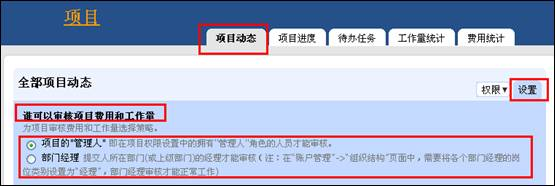

2：部门经理: 提交人所在部门(或上级部门)的经理才能审核

首先我们需要在“账户管理”->“组织结构”页面中，将各个部门经理的岗位类别设置为“经理”，部门经理审核才能正常工作

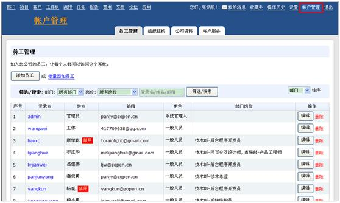

选择相应的人员，点击“编辑”按钮，如需要设置其为行政部的行政经理，管理行政部所有人员的日常费用审批

将各个部门经理的岗位类别设置为“经理”后，我们在项目权限设置关于谁可以审核项目费用和工作量处选择部门经理进行审批。

财务人员角色设置
..............................

财务人员的角色设置也是通过在账号管理的岗位进行的设置，同时系统为了方便财务人员可以查看所有项目的费用情况，在个人预算模块的权限设置处进行设置。

在超级查看人的角色授权中添加财务人员用户，财务人员就可以查看所有项目的费用情况。

费用预算过程
----------------------------------------------
易度项目管理系统提供了一个科学合理的费用预算控制功能，可进行项目内和跨项目的项目费用预算控制。

用户登录系统在“费用统计”模块可跨项目的统计所有项目的费用情况，部门经理进行费用预算审批。

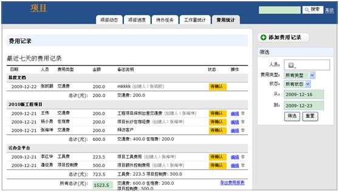

在每个项目工作空间中，易度项目管理平台提供了“费用” 模块，可针对具体某个项目轻松进行项目费用预算申请。系统默认显示该项目所有人从开始到现在处于所有状态的费用记录情况，包括项目的费用日期、人员、费用类型、金额、备注说明、费用状态等具体记录信息。

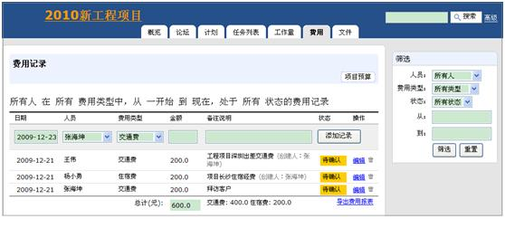

预算申请
..................
工程人员需要对某个项目进行个人费用预算申请时，首先选择具体某个项目，进入个人预算，在添加个人预算栏中输入个人的各类费用预算计划，包括具体交通费、住宿费、工具费等各类费用预算金额，点击“添加预算”按钮，提交费用预算申请

预算确认
..................
根据用户事先预设好的费用预算确认角色，工程项目人员提交费用预算申请后，部门经理或者项目的“管理人”进入系统费用统计，将收到项目人员提交的费用预算申请，根据项目人员的项目费用预算申请明细，进行审批确认，点击“待确认”按钮，审批确认通过

支取预算
...............
费用审批通过后，财务人员进入系统进行费用确认，查看到项目人员提交的费用预算申请已经进行了确认，同意发送预支资金，将相关的费用交付工程项目人员。

费用报销过程
------------------------------

易度项目管理系统支持项目内和跨项目的项目费用报销，用户登录系统在“费用统计”模块可跨项目的统计所有项目的费用情况，部门经理进行费用调整和确认。在每个项目工作空间中，易度项目管理平台提供了“费用” 模块，可针对具体某个项目轻松进行项目费用报销。

报销申请
...........................
工程人员需要对某个项目费用进行报销时，首先选择具体项目，点击“费用”按钮，进入费用模块，在添加费用记录栏中输入项目实际消耗的费用明细信息，包括日期、费用人员、费用类型、金额、备注说明，点击“添加记录”按钮，提交费用报销申请

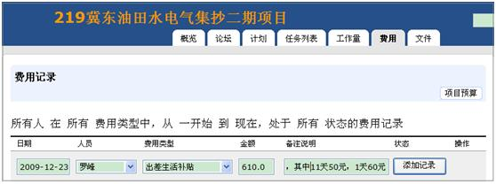

报销审批
...................
根据用户事先预设好的费用预算确认角色，工程项目人员提交费用报销申请后，部门经理或者项目的“管理人”将会收到报销申请，根据项目人员的费用报销明细，进行审批确认

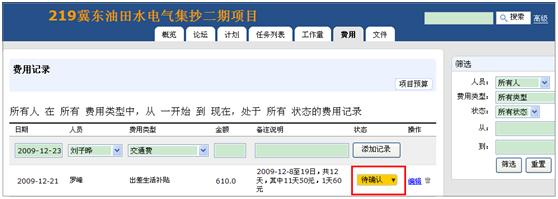

右侧提供筛选功能，筛选类型包括人员、费用类型、状态、费用开始时间、结束时间，当费用报销结果过多时，可点击“筛选”按钮，进行筛选查询

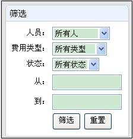

财务核对
........................
报销审批通过后，财务人员将进行费用核对，根据多退少补的原则，发生的实际费用消耗费用明细都将和费用预算形成对照表，便于财务进行风险控制。

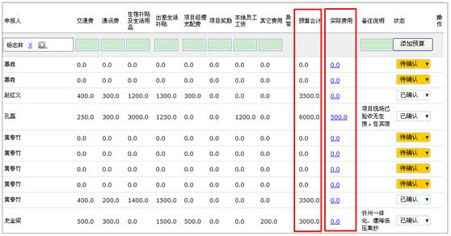

此外易度项目管理系统提供报表导出功能，可把项目费用导出报表，方便财务人员作为费用核对的依据。

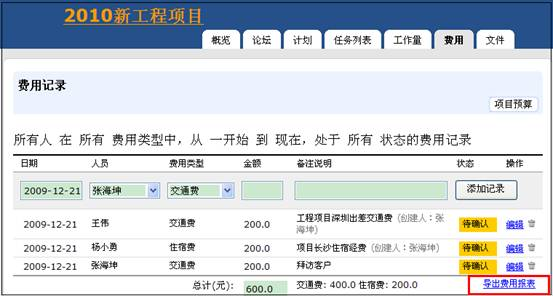

导出格式为 csv文件，可使用excel打开

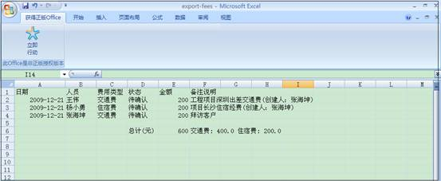

项目预算：项目费用监控
-------------------------------------

系统提供项目预算功能，能够设置各个项目的费用预算，在项目立项做计划的同时来建立项目预算，项目预算建立后，财务人员便可根据项目的预算费用和项目成员报告的费用使用情况进行分析，特别是对于费用超支进行分析，采取预算和实际费用对照的方式，方便进行财务分析。

点击“项目预算”按钮，进入项目预算费用界面，系统显示项目的所有预算费用信息，包括起始日期、结束日期、交通费、住宿费、工具费、项目控制费、招待费、通讯费明细、合计金额和实际费用金额，方便进行对照分析。

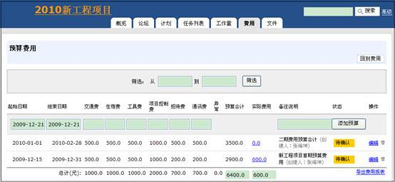

进入项目管理系统的“项目进度”模块，可查看整个项目的实际费用和预算对照情况，方便财务人员进行费用分析。

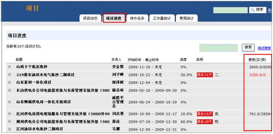

怎么样，有了易度项目管理管理系统的费用管理功能，企业轻松解决项目费用预算、项目人员费用报销、项目费用统计等费用问题，建立更稳妥、更简单的财务预算，减少公司财务风险。

我们本期的淘宝记就到这里了，下期再见，拜拜......

