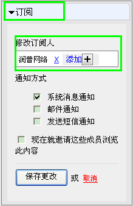
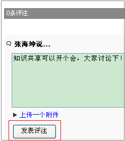
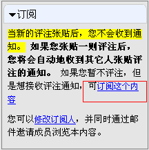
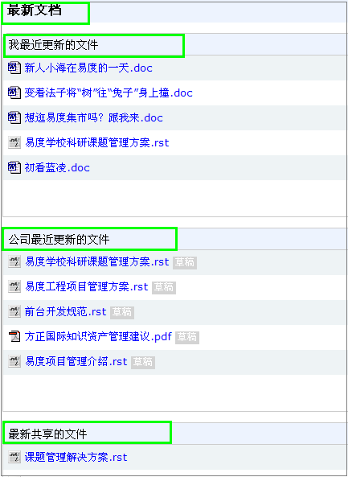

================================
变着法子将“树”往“兔子”身上撞
================================

“守株待兔”这个古老的故事想必大家都知道，然而，在今天知识经济的时代，我们却要变着法子将“树”往“兔子”身上撞。你可能会问，这话怎么讲呢？别着急，下面我就和大家聊聊如何变着法子将“树”往“兔子”身上撞。

知识经济时代，企业越来越重视知识管理的重要性，希望能够将最合适的知识在最合适的时间传递给最合适的人。那么怎样才能将合适的知识有效传递给合适的人呢？还回到我们刚说到的“守株待兔”的故事。如果我们把“知识”比喻成“兔子”，那么人们如何能够收获更多的“兔子”呢？现在这个知识经济的时代，只靠“守株待兔”，可能就落伍了，而在这方面，我们的易度文档管理系统走在了知识管理的前列，下面就看看易度文档管理是如何变着法子将“树”往“兔子”身上撞吧！

易度文档管理采取知识推送的原则，变着法子将“树”往“兔子”身上撞，比如：知识订阅、知识评注、知识发布、知识推荐等功能，都是有效的知识促销手段，它们能够帮助企业“在最合适的时间，将最合适的知识传递给最合适的人”。

知识订阅，可为文档添加订阅人，与消息和邮件结合，通过采取系统消息通知、邮件通

知、发送短信通知等手段通知或邀请相关成员浏览文章内容，增强人员之间的知识共享和沟通，此为将“树”往“兔子”身上撞的方法1

知识评注，可对有权限的文件进行评注，参与到文件协作中来，而且还可以对文件评注进行消息订阅和邮件订阅，通过评注收集各人的看法，及时反馈相关信息，增强人员之间的知识协作与沟通。此为将“树”往“兔子”身上撞的方法2。

下面是对文件评注进行消息订阅和邮件订阅。点击评注通知，进行订阅消息。

知识发布，通过采取邮件外发的手段，将自己的文档传递给适合的人查看。

.. image:: img/rabiit04.png

知识推荐，系统会自动将最新文档显示在界面首页，包括我最近更新的文件、公司最近更新的文件和公司最近共享的文件，通过采取这种推荐最新文档的方式，达到知识传递和共享的目的。此为将“树”往“兔子”身上撞的方法4，如下图。

易度通过以上四法，力图帮助企业能够更好地做到知识共享，“在最合适的时间，将最合适的知识传递给最合适的人”。大家想收获更多的“兔子”吗？就让我们和易度一起变着法子将“树”往“兔子”身上撞吧！

