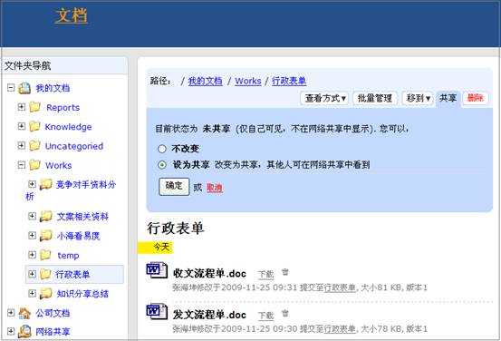
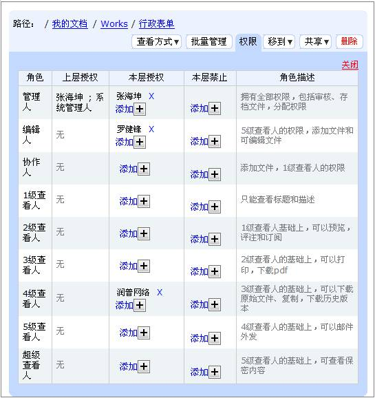
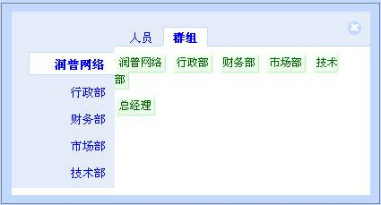
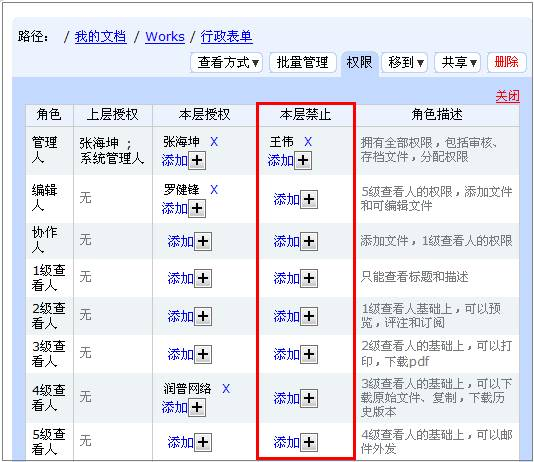
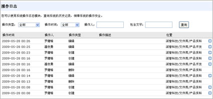
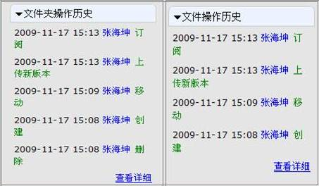
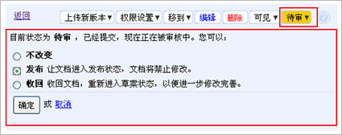

===============================================
又要知识共享又要信息安全怎么办
===============================================

最近，在网上看到一篇帖子，是关于企业在推进知识管理的过程中，很希望知识能够得到充分共享的，可老是会遇到一些问题，比如上级和业务部门都很强调信息安全，这又导致了大家知识共享的热情不高，对知识管理的推动有很大的阻碍，所以就对究竟该如何处理好两者之间的关系大家展开了讨论。

有人说安全和共享天生不是一对矛盾体，安全体系主要解决是把该保密的资讯传递到了不该传递的对象或者空间，而共享体系解决的是把该传播的内容转播到传播的地方去。

也有人说知识共享与信息安全看似是矛盾的两个方面，但落地到具体情况矛盾的深度是大不同的。任何的知识共享都会带来信息不安全的威胁，只是这种不安全性的重要情况不同而已。首先要针对不同安全程度的知识进行分门别类，对于安全威胁性不高的知识，可以采取全盘托出、众人齐享；对于安全威胁性很高甚至是机密的知识或文档，则要谨慎的划定可以跟哪些人共享或者是不共享，只有这样，才能做到“安全共享”。 

那么怎么样做到既要知识共享又要信息安全呢？易度文档管理系统帮助您！

知识共享
=========================
易的文档管理系统采用分区管理，包括个人区、公司文档区和网络共享区。其中个人区是个人在服务器上的可靠存储区，公司文档区是由公司统一控制的文档资料区。网络共享区就是个人区共享的文件和资料。当我们需要把个人的知识和资料和公司其他同事进行共享时，首先选择需要共享的个人区文件夹，如我需要将我搜集整理的行政表单文件内容和同事一起分享，只需找到这个文件夹，点击菜单栏的“共享”按钮，选择设为共享，就完成了知识共享的操作。此时将会看到文件夹的图标属性变成了一只手，代表着奉献自己的知识和大家一起共享。

知识安全
=========================
在知识安全性方面，易度文档管理系统可以做到以下几个方面：

授权委托管理和5级别保密控制
----------------------------------------------

可单独针对各个文件夹，指定文件夹管理员。文件夹管理员在该文件夹下拥有全部管理权限，可实现真正的权限委托管理。

5级别保密控制，可以控制文档预览、添加、编辑、移动、复制、下载等权限，这样就可以解决文档共享过程带来的知识安全性问题，通过进行权限控制，授予或限制团队成员对共享文件夹的功能操作。

权限委托管理和5级保密控制解决了个人和公司文档在共享过程中产生的安全问题，既可以保证团队成员有相关的权限浏览、阅读相关共享资料，提升自我知识，也可以授予或限制成员的操作权限，控制文档的安全性。

成组授权
---------------------------------
可针对某个部门、某个岗位进行授权。这样新人到岗，只需指定所在岗位，便可自动得到相应的文档访问权限。成组授权操作简单，只需在权限操作中按群组进行权限设置。

成组授权，既可大大减轻管理的负担，也可做到控制文档的安全性。

负授权
----------------------------------
系统支持“负授权”，也就是可以禁止某个人的权限。

这个技术结合群组授权，可实现如下的逻辑：行政部除了张三都能够查看某个文件。

“负授权”技术，使授权更灵活，更实用，充分保障知识文档在共享、使用过程中的安全性。

文档使用痕迹检视
-------------------------------
每一个文档的所有操作都会记录操作历史。可对单个文件、某个文件夹或者整个系统，进行操作历史查询。

这一功能可以确保在知识的共享、使用过程中一旦出现安全事故，可进行追查，追究事故责任人。

实用的受控文档审核流程
------------------------------
* 采取受控管理，审核通过的文档才能外发。
* 支持审核的一般流程：提交审核—>审核通过—>正式发布，采用消息通知流程变更
* 一旦发布，禁止对文档的修改，实现文档保护
* 将文件夹设置为受控状态，只有发布的文档才能被普通用户查看 
* 一旦发布，可设置文档的有效期限和文件编号 
* 在线打印的时候，可自动补充发布信息，方便打印文档正确性控制 

支持HTTPS安全传输
----------------------------------
可使用apache的安全传输https的功能，采用网上银行相同的技术，实现文件的安全传输。

ClamAV病毒扫描防护
---------------------------------
系统自带ClamAV（http://www.clamav.net/）作为病毒扫描引擎。

上传文件，均会进行病毒扫描，如果发现病毒，会通知管理员进行处理。

  总之，易度文档管理系统针对企业用户的知识共享和知识安全需求，提供不同的安全手段，做到对于安全威胁性不高的知识，可以采取全盘托出、众人齐享；对于安全威胁性很高甚至是机密的知识或文档，谨慎的划定权限，做到“安全共享”。 

