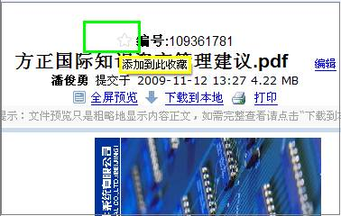
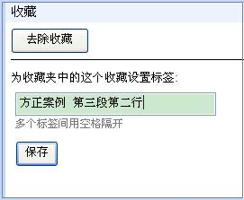
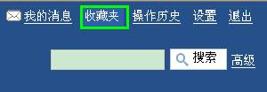
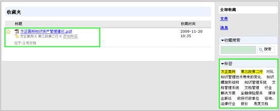
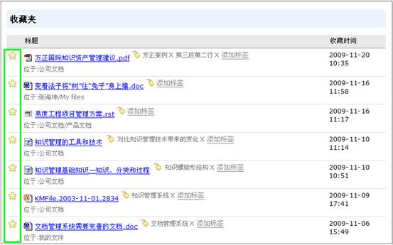

===============================
易度淘宝记—收藏夹
===============================

在知识经济时代，相信大家都有过这种经历，面对知识的海洋，人们要想淘到自己对自己有价值的知识宝贝，真是不容易。而我们今天要给大家晒的宝贝就是易度文档管理的收藏夹功能。 

收藏夹可以根据用户使用需要，将文档进行收藏，添加到收藏夹中的文档可进行自主定义标签管理，方便个人的使用和查找。收藏夹功能解决了用户查找和利用资料的难题，方便用户对知识进行自我管理。下面就通过举例和截图的方式向大家展示一下收藏夹的功能。 

1 收藏一个文档
===========================

当用户需要将有价值的文档进行收藏时，只需点击文档标题编号左侧的星型添加收藏夹功能，系统就会提示已成功将文章添加到个人收藏夹里。

可以对收藏的文章进行自定义标签。（注：自定义的标签不影响文件夹的原有标签属性，只是作为自我管理文件的一种方式） 

如将我们刚刚收藏的《方正国际知识资产管理建议.pdf》文章进行自我定义，添加标签，因为此文章的第三段第二行对自己写文章使用有帮助，所以我们可以进行如下的标签定义。

点击保存，刚刚收藏的文档就会根据用户的需要打上标签。  

2 收藏的管理
===========================

点击窗口右上侧菜单栏的收藏夹

可以方便快捷地查看到个人收藏的有价值的资料，并且可以对收藏的文章进行管理。包括收藏的文件搜索、如何去除收藏、如何管理收藏的标签以及标签搜索等。下面重点介绍下创新实用的标签搜索。

如我们需要在收藏夹中搜索到《方正国际知识资产管理建议.pdf》这篇文档，只需在标签组中选择相应我们自定义的标签，如方正案例 第三段第二行，系统就会自动筛选出相应收藏的文档。

另外，当我们不需要相关资料，需要对收藏夹的相关知识进行管理删除时，只需点击收藏夹相关文件前的星型按钮，就可以轻松完成文件的收藏删除。

当我们需要用到相关资料时，可以借助收藏夹功能将有价值的资料进行收藏，并且可以根据个人需要进行自定义标签，当需要使用这些有用的文档时，就可以直接通过收藏夹方便快捷地进行文件查找和定位，便于用户进行自我知识的管理。有了易度文档的收藏夹，就等于随身携带了一个知识的百宝箱，当你面对知识的海洋时，想淘到对自己有价值的知识宝贝，原来很容易，个人的知识管理原来就在我们的身边。 

好了，我们本期的淘宝—收藏夹就先到这里，我们下次再见，拜拜…… 

