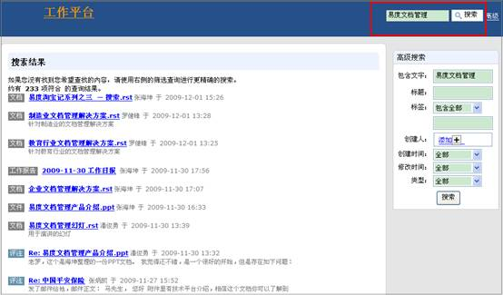
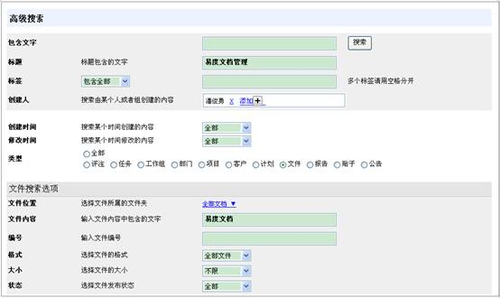
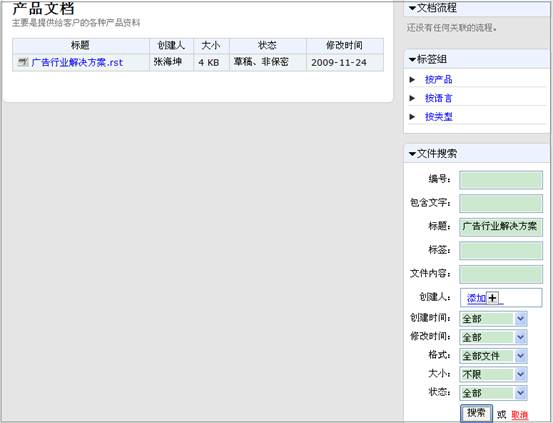
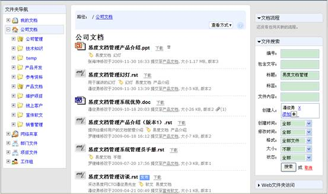
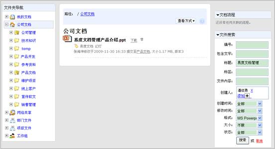
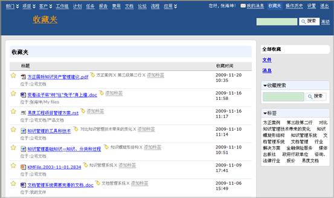

==================================================
易度淘宝记系列之三 — 强大的搜索功能
==================================================
大家好，本期的淘宝记要给大家晒的宝贝是易度文档管理系统强大的搜索功能。

企业常见问题
===========================
今时今日，企业所面临的主要挑战之一是如何从知识中获得更多的价值，尤其是企业自身一点一滴辛苦积累起来的知识。对于这些知识员工们利用情况是怎么样的呢？

* 员工发现，在公司知识库中搜索信息的过程并非一帆风顺； 
* 他们无法自如地在不同类别的知识之间进行浏览； 
* 由于没有得到相关的背景资料，他们无法衡量所找到的知识的价值。 

许多知识工作者会为此而放弃搜索的努力。其实，如果能够找到相应的知识的话，他们就能更好地服务客户，或进行创造性的研究。

易度文档管理系统
===========================
易度文档管理系统提供强大的全文搜索、高级搜索、标签组搜索、收藏夹搜索、关联文件搜索，保证用户在庞大的企业知识资料库中能够方便、快捷地找到属于自己的知识。

强大的全文搜索
----------------------------------------------
提供中文全文搜索技术，可搜索PDF,XML,HTML,TXT等文档内部的文字。 

如我需要搜索关于易度文档管理方面的文档，只需在搜索栏中输入关键字，即搜索出所有关于易度文档管理的文档内容。包括文件或评注中涉及到易度文档管理的内容都可以搜索到。

高级搜索
---------------------------------
可根据标题、创建时间、标签、格式等条件进行高级搜索

点击搜索栏旁的高级选项按钮，进入高级搜索。

基于位置的搜索
----------------------------------------------
传统的文档管理系统，都无法做到基于位置的搜索。易度文档管理系统包括一个路径索引，可限定在指定文件夹内进行搜索。 

.. image:: img/search3.jpg 

点击高级搜索，同样支持在指定的文件夹内进行高级搜索

搜索后的继续筛选
----------------------------------------------
易度文档管理系统支持搜索后可以在结果中继续筛选您所想要的内容。其他系统很少实现这样的功能，大多数系统在搜索后就是列表显示，或者提供排序。而易度文档管理系统可以做到在结果内继续搜索。 

如我们在搜索栏中输入标题含有“易度文档管理”的内容，搜索完毕后我们还需要进一步筛选。我需要进一步在结果中搜索创建人为“潘俊勇”，只需在输入栏中添加创建人，即可进一步在所有标题为“易度文档管理”的内容中筛选创建人为“潘俊勇”的文档。

筛选完毕后，我们还可进一步进行筛选。如筛选格式为MS Powerpoint的创建人为潘俊勇的易度文档管理知识。

搜索后的继续筛选功能满足了用户搜索的多样化需求，保证用户搜索过程一帆风顺。

标签组搜索
---------------------------------

易度文档管理系统提供创新、实用的标签组功能，当我们需要快速查找到知识库中已经打上标签的相关文章时，都可以通过标签组方便、快捷地查找到相关标签属性的知识。

如我们需要查找到相关知识管理实施方面的文章时，我们就可以从标签组选择文章和知识管理实施的标签，这样就可以方便、快捷地定位到我们需要的文档。

收藏夹搜索
---------------------------------

收藏夹功能相当于一个小型的个人知识库，便于用户进行自我知识的管理。

当我们需要用到相关资料时，可以借助收藏夹将有价值的资料进行收藏，并且可以根据个人需要进行自定义标签，当需要使用这些有用的文档时，就可以直接通过收藏夹方便快捷地进行文件查找和定位。在收藏夹内同时支持收藏搜索和标签搜索。

怎么样，有了易度文档管理系统，在面对知识的海洋时，想淘到对自己有价值的知识宝贝，原来很容易。我们本期的淘宝记就到这里了，下期再见，拜拜......

