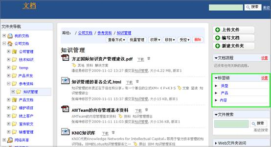
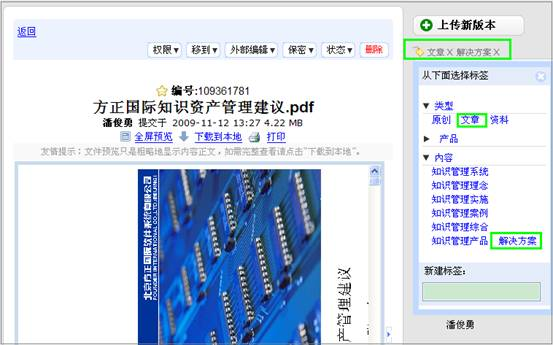
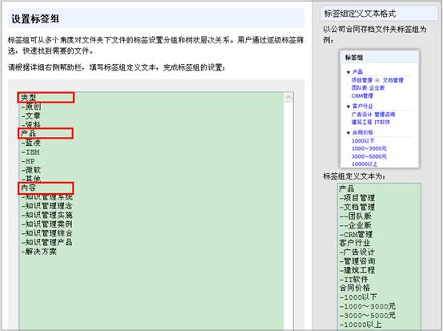
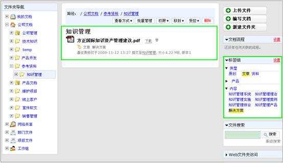

===============================
易度淘宝记—创新实用的标签组
===============================

大家好，上期我们的淘宝记给大家介绍的是易度文档管理的收藏夹功能，这期我们要晒的宝贝是易度文档管理创新实用的标签组功能。

标签组功能帮助企业用户对文档进行多角度的定义，大家都知道传统的文件夹分类的限制：一个文件只能有一个分类， 文件夹层次太多太乱，
是我们找不到文件的根源。而采用易度分组标签， 方便对文件进行分类管理，准确进行文件定位。 类似百度百科的开放分类，每个文档可
设置多个分类标签。 下面就通过举例和截图的方式向大家展示一下我们的标签组。（绝对好用，看后你就知道了）

1. 有管理的标签
===========================

1.1 简单、易用地对标签组进行设置管理
-----------------------------------------------------------------

点击标签组右侧的设置按钮，就可以对标签组进行内容管理，包括添加、删除、编辑分组标签内容

1.2 方便、快捷地对文档进行添加标签、删除标签管理
-----------------------------------------------------------------
如我们需要将知识管理文件夹下的一篇文档《企业如何实施知识管理》为例打上标签，便于使用时进行文件定位和查找。我们只需点击添加标签按钮，
从标签分组中选择文档所属的标签属性，如按类型说来它属于文章，按内容说来它属于解决方案的内容，这样我只需打上相应的标签，就对这篇文章进行了多维度的定义。 
如果需要删除文档的某个标签属性，只需点击标签组右侧的删除符号，即完成文档的标签删除。

2. 多维度和多层次的标签
===========================
分组标签支持多维树状导航，可从多个角度对文件夹下文件的标签设置分组和树状层次关系，比文件夹文类更灵活。
可对标签进行第一级、第二级......逐层进行细分

3. 标签组查询
===========================

当我们需要快速地查找到相关文章时，我们就可以从标签组选择相关属性的标签，
如我们需要查找到相关知识管理实施的文章时，我们就可以从标签组选择文章和知识管理实施的标签，
这样就可以方便、快捷地定位到我们需要的文档。

 

怎么样，大家跟我逛到这里，今天的淘宝记是不是还不错啊。想继续淘到更多新颖的产品吗，那就请大家关注我们的
易度淘宝记吧，下次我们再来。拜拜…… 

