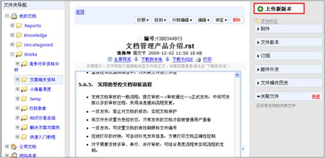
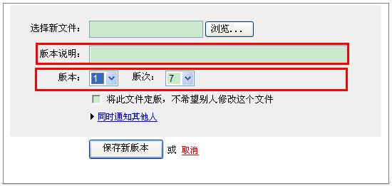
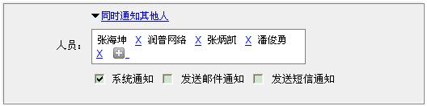
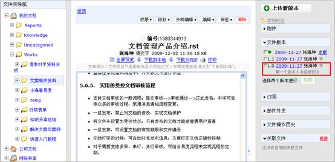
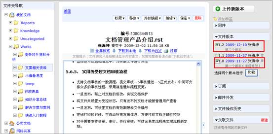
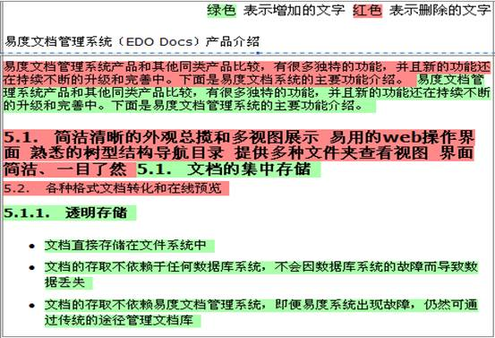
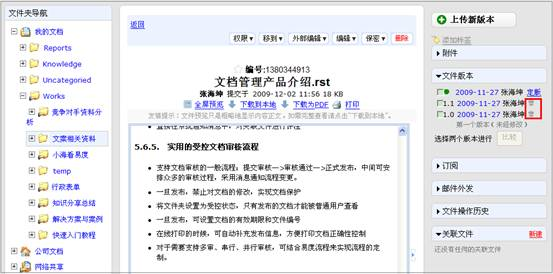

==================================================
易度淘宝记系列之 — 强大易用的版本管理
==================================================

.. Contents::
.. sectnum::

大家好，又到了新一期的淘宝记。本期要给大家晒的宝贝是易度文档管理系统强大易用的版本管理功能。

企业常见问题
====================================================
企业在文档版本管理方面通常存在以下问题

* 文档版本繁多，难以整合和统一管理。
* 文档版本无法恢复，造成知识流失。
* 经常出现使用错误的文档版本的现象。

认识文档的版本管理
====================================================

为了帮助企业解决文档版本管理方面存在的上述问题，下面我们先认识下文档版本管理总体的原理图

.. image:: img/结构图.JPG

文档的版本包括当前版本和历史版本。当前版本是用户当前的工作版本，可以自由进行修改，用于文档需要进行频繁修改阶段，此时文档处于不稳定的编辑状态。而历史版本是已经处于稳定状态的文档版本，历史版本不能进行修改，可以供用户进行下载查看。系统支持版本版次维护功能，版本标示文档大的变化，版次标示文档小的变化，版本版次的作用是对历史
版本进行标识。版本版次系统自动生成，用户也可以手动进行调整。另外提供版本说明功能，对历史版本可进行文字说明。

系统提供两种方式用于将当前版本切换到历史版本，一种是通过上传新版本的方式，用户上传新版本的时候，系统自动推荐一个版本版次，用户也可以手动进行调整。一种是通过定版的方式。一旦定版，当前版本进入历史版本，对该文档的任何修改，会在自动生成的一个新的工作版本中进行。 

易度的版本管理功能
=================================================

易度文档管理系统提供强大的版本管理功能，帮助企业解决文档版本管理方面的难题。

上传新版本
----------------------------------------------
易度文档管理系统提供新版本上传功能，通过上传新版本，将当前的版本切换到历史版本。

选择找到需要进行版本更新的文档，点击窗口右侧的“上传新版本”功能按钮

在弹出的上传界面中点击“浏览”按钮选择新文件，在版本说明栏中可输入文字描述，系统自动推荐一个版本版次，用户也可以手动进行调整。

用户在上传新版本同时，系统可采取通知方式告知其他人新版本的上传信息，包括系统通知、发送邮件通知和短信通知。点击“同时通知其他人”，可进行人员的添加，并选择通过系统通知、发送邮件通知和短信通知的方式告知其他人输入完上述相关信息后，点击“保存新版本”按钮，完成文档新版本的上传

版本历史管理
----------------------------------------------

工作版本、历史版本的界面显示区别
.................................................................

系统将当前的工作版本前绿色标识进行突出显示，历史版本通过版本版次及版本说明进行标识显示。

.. image:: img/界面显示.JPG

下载历史版本
.................................................................

易度文档管理系统提供获取历史版本功能，帮助用户在文档多版本中查找到历史版本，以免造成知识流失。

找到需要获取历史版本的文档，在右侧栏文件版本中找到需要下载的历史版本

点击版本链接地址，系统将弹出文件下载界面，用户可进行历史版本的文件下载

版本差异比较
.................................................................

易度文档管理系统支持文件版本差异比较功能，所有可以在线预览的文档，均可支持在线版本差异比较。 用户可在文档的多个版本中选择两个版本进行比较，版本比较的结果会自动显示，包括两个版本中有增加的文字和删除的文字都会采取颜色对比形式进行显示。

找到需要比较版本的文档，在右侧栏文件版本中选中2个需要做版本比较的历史版本文件

点击下方的版本比较按纽，版本比较的结果会在中间模块上显示，包括增加的文字和删除的文字。绿色表示增加的文字，红色表示删除的文字，采取颜色对比形式进行比较结果显示。

用户可以点取消版本比较按纽，结束版本比较，回到文件详细页面

删除历史版本
.................................................................

对于用户来说，文档版本繁多，有些历史版本需要进行删除，否则会经常出现使用错误版本的现象。易度文档管理系统提供版本删除功能，用户可方便快捷地将不需要的历史版本进行删除。

找到需要删除历史版本的文档，在右侧栏文件版本中找到需要删除的历史版本文件

点击版本信息文件名后面的删除图标，完成历史版本文档的删除

定版功能
----------------------------------------------
系统支持定版功能，一旦定版，当前版本进入历史版本，对该文档的任何修改，会在自动生成的一个新的工作版本中进行。 

选择需要进行定版的工作文档，点击文件版本右侧的“定版”功能按钮，

.. image:: img/定版.JPG

系统自动推荐一个版本版次，用户也可以手动进行调整。可根据用户需要输入版本说明，点击“定版”按钮，完成文档定版。

.. image:: img/定版2.JPG

文档编写界面的集成版本管理
----------------------------------------------
当文档处于编辑状态时，也可以进行版本管理。在编写界面的底端系统提供保存功能及保存新版本功能。

保存功能主要用于文档进行频繁修改时，直接点击“保存”，将修改结果保存到当前工作版本中，不形成新版本。点击“保存为新版本”功能按钮，将会生成一个新的版本，当前版本自动生成历史版本。同时可进行更改版本号。

.. image:: img/集成版本管理.JPG

怎么样，有了易度文档管理系统强大、易用的版本管理功能，在面对企业文档版本管理问题原来很容易。我们本期的淘宝记就到这里了，下期再见，拜拜......
