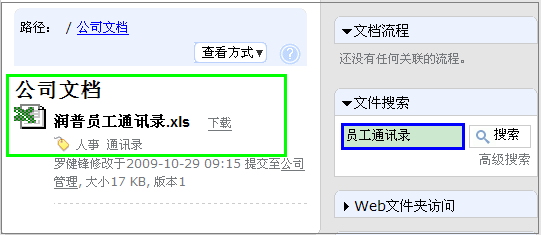

=============================
新人小海在易度的一天
=============================
大家好，我叫小海，小海？男孩吧，呵呵，大家就猜错了，我是来自北方的女孩，是刚工作一年多的新人，刚刚来到新公司润普公司工作没几天。 

作为新人，到新公司初来乍到，大家的第一感受是什么呢？我想大家的感受和我的一样，作为新人到新公司后学习的东西实在太多，通常都是一头雾水，不能很快的掌握相关岗位需要的资料。对于各种各样的资料，都要自己尽快去接手，有时需要了解一些资料都不知道去问谁，不知从何学起。有的公司还有很多内部系统产品需要新人学会使用，总之这一切做起来都很费时间，效率也低。但是来到润普工作开始接触了易度产品，易度产品的使用使我改变了这个想法，原来产品使用起来也可以这么省事、方便，原来使用产品也可以帮助员工提高学习工作效率。下面我谈谈在易度的一天。 

上班开始，作为新人，我需要学习很多的知识，包括公司资料、产品知识、公司规章制度、公司同事的通讯录等等，许多岗位资料都要求我尽快熟悉掌握，公司培训又不可能面面俱到，而且公司培训新人也需要花费一定的时间和培训成本。想到这些都有点心慌，怕怕的感觉。怎么办呢？易度的文档管理系统这时就解决了我这个问题。我只需在易度上登录我的账号和密码，进入文档管理，就可以轻松、快捷地查阅公司相关的资料，包括我要掌握的公司资料、产品资料、公司规章制度、公司员工通讯录等等，公司的知识资产都可以在里面查看的到，每一篇文档对于我一个新人来说都是很重要的，我想这是公司培训过程中不能做到的，因为培训不可能做到面面俱到。而在这里，我却可以对公司整个资料有详尽的了解。文档管理使用起来方便、快捷，操作界面一目了然，通过导航目录就可以方便快捷地查阅相关资料文件夹。首先我需要知道的就是公司员工的通讯录，将公司新同事的联系方式记录下来，所以我首先在左边导航栏中选择了公司文档，呵呵，这个可是个知识的小金库，里面都是我要学习的知识。接着就在文件搜索中输入我要搜索的员工通讯录，哈哈，果然很有效，不到1秒，润普员工通讯录果然出现了。下面我把这个操作的截图分享出来，大家看看是不是很方便使用啊！ 

怎么样，是不是很快捷方便啊。一目了然的操作界面，让用户可以方便快捷地找到需要的资料，不用东问西问。 

易度文档管理系统解决了新人和公司的难题，一方面可以让新人通过文档管理系统对公司的文档即知识资产进行全面的熟悉掌握，让新员工可以迅速融入到新公司中，以最短的时间熟悉岗位职责，掌握岗位相关要求。另一方面可以让公司减少了新人的培训成本，将节省出的时间和成本用于公司发展。 

一天下来通过文档管理系统，我收获了好多，对公司的基本背景资料、公司的产品资料、公司规章制度、岗位的职责等方面都有了基本的了解，到快下班的时候了，该进行下总结了。对于试用期的新人来说，公司需要对其工作、学习情况有一定的了解作为考核依据，这就需要有一定的考核机制。而易度产品的报告就解决了这个问题，通过提交报告，我将一天的工作进行了总结，选择了要汇报的考核人，就可以进行提交报告了。也可以查看到刚刚提交的报告是否提交成功，明天上班来还可以看得到上级经理对自己报告的考评，知道自己今天的工作情况是否合格有什么需要改进的方面。怎么样，是不是使用起来很方便啊。一天的工作就这样结束了，通过易度产品，既方便快捷地学到了相关岗位知识，又将一天的工作心得进行了总结，真是充实的一天。 

