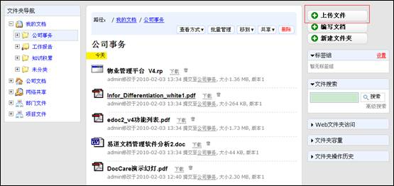
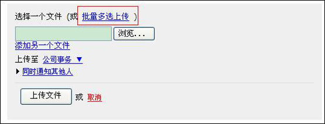
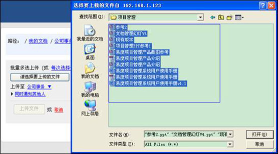
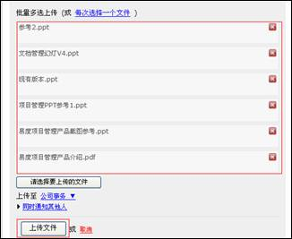
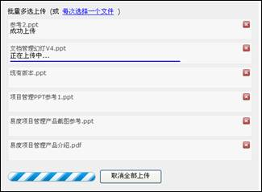
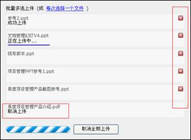
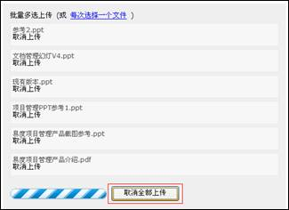

==================================================================
新特性：批量上传更容易
==================================================================

.. sectnum::

易度文档管理系统新增批量上传功能。此功能是易度新增的文件上传功能，您可以更方便的进行批量文件的上传操作，上传起来更方便、更易用。

批量上传的问题
====================================================

我们易度文档管理系统在文件批量上传存在的问题：

1. 现有的的简单上传功能，在实现多选操作时太复杂，在用户不知道上传进度情况下，不能取消文件的上传操作。

2. 现有的web文件夹批量上传功能，虽然能够实现批量文档上传，但设置操作太复杂，普通人员难以掌握。

因此，迫切需要一个“更傻瓜”、更易用的批量上传功能。针对企业客户通常需要大批量的进行文件上传操作的需求，我们易度闪亮推出了简易高效的批量上传功能，可在文件上传界面上直接进行批量上传。下面是关于新增的批量上传功能介绍

  
批量上传功能介绍
====================================================

批量多选上传
----------------------------------------------

1）在左边的文件夹导航处选择需要上传文件的目标文件夹，点击“上传文件”按钮。

2）在弹出的界面中，可根据用户需要选择单个文件上传或批量多选上传。我们选择进行批量多选上传。

3）接下来选择需要进行批量上传的文件,可直接用鼠标左键框定需要上传的多个文件。

4）如果还有文件需要上传，可以点击再批量添加多个文件。添加完成后，按“上传文件”按钮进行批量文件的上传。

显示上传进度
----------------------------------------------

系统支持在批量上传过程中自动显示上传进度，蓝色进度条表示文件上传的进度显示。

取消文件上传
----------------------------------------------

用户在上传过程中如果需要取消某个文件的上传，可直接点击文件右侧的删除上传按钮，取消该文件的上传。点击下方的取消全部上传按钮，可以取消全部文件的上传。

取消单个文件

取消全部文件

成功批量上传
----------------------------------------------

批量上传成功，用户可查看到刚刚批量上传的文档。

有了易度文档管理系统新增的批量上传功能，面对企业文档批量上传管理问题原来很容易
