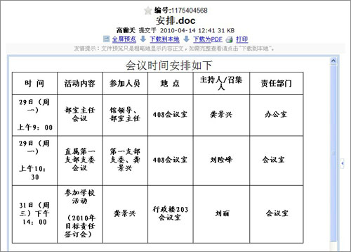
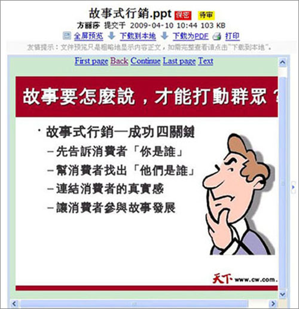

===================================
最佳的office文档预览效果
===================================

刚刚发布的2.4版，一个重要的特性就是，对pdf的预览几乎达到了完美。

而现在，我们可以说，对word、excel、ppt这样的常用办公文档，我们也达到了几乎完美的预览效果，可做到最精细的转换预览。

我们来看看效果：

1. word文档的预览：复杂的表格不会错位了

2. ppt的预览：可以转换为图片，实现无损的预览了

3. excel的预览：从前就不错，现在更好了！

.. image:: img/excel.jpg

**注意：** 目前仅仅文档管理的演示站点，才部署了这个转换工具。其他的在线注册的站点，处于服务器性能方面的考虑，还没有部署。

因此，您可以进入我们的演示站点体验： http://dms.easydo.cn (admin/123456登录)