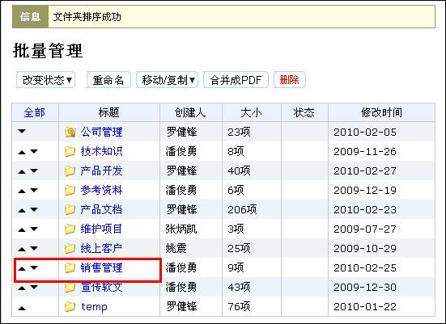
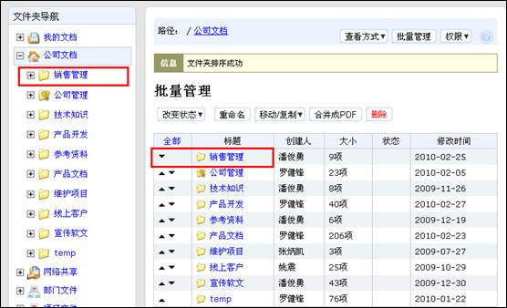
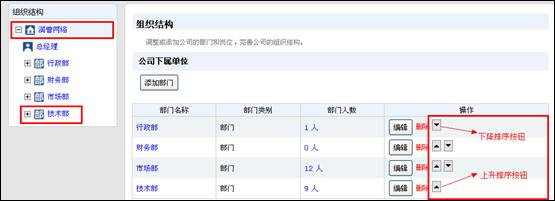
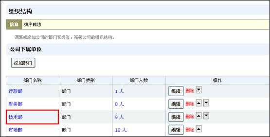
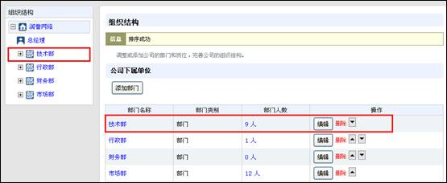
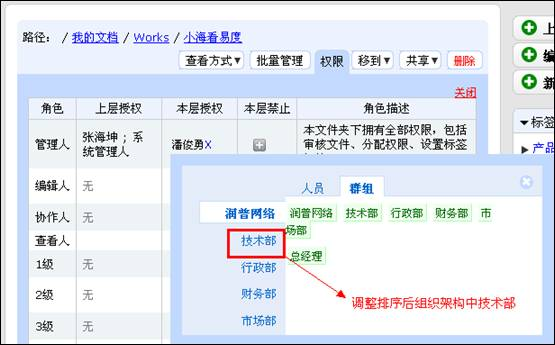

====================================================
易度文档新增文件夹排序和组织架构排序功能
====================================================

.. sectnum::

希望把重要的文件夹放在导航树的上方？人员选择的时候，希望调整部门的顺序？

现在，易度文档管理系统已经新增了文件夹排序、组织架构排序功能，让文件夹结构和组织架构组织和显示更加合理。

新增文件夹排序功能
====================================================

新功能支持文件夹排序，用户可根据工作实际需要，对文件夹进行排序，包括所有父文件夹及其子文件夹，都可以进行位置的调整。

1）如作为市场部的员工，根据工作需要，需要将“销售管理”文件夹调整到首位，排在文件夹导航树的最上方。在左边的文件夹导航处选择文件夹“销售管理”所在的上一层文件夹—公司文档，选择右侧的“批量管理”功能按钮

.. image:: img/t1.jpg

2）在批量管理界面，可看到各个文件夹前的调整排序的上升和下降的箭头按钮，根据用户需要，进行文件夹排序。

.. image:: img/t2.jpg

3）点击文件夹“销售管理”前的上升按钮，该文件夹将排序上升一位。按照此步骤，接着进行排序，将其调整上升到首位。

4）调整排序后，可查看到左侧文件夹导航处相应的文件夹位置成功进行了调整。

如果需要对导航栏处的父文件夹下各个子文件夹进行排序，也按照这个步骤。

.. image:: img/file5.jpg
  
新增组织架构排序功能
====================================================

新功能支持组织架构排序，用户可根据工作实际需要，对组织架构中的各个部门进行排序。

1）如根据用户工作需要，我们要将组织架构中的部门技术部进行排序调整，将其调整到首位。在左边的组织架构导航处选择“技术部”所在的上层—润普公司，右侧组织架构部门后可查看到调整排序的上升和下降箭头按钮，根据用户需要，进行组织架构排序。

2）点击部门“技术部”后的上升按钮，该部门在组织架构中的排序将上升一位，排在“市场部”的上方。按照此步骤，接着进行排序，将其调整上升到首位。

3）调整排序后，可查看到左侧组织架构导航处部门组织架构成功进行了调整。

4）调整后，进行人员选择的时候，即可按照新排序的组织架构进行使用。

以上是我们易度文档管理系统新增的相关功能，将使您在工作中使用起来更易用、更方便。同时，我们也欢迎大家体验和反馈问题给我们，请登录http://edodocs.com/。
