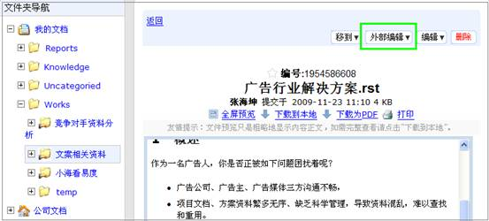
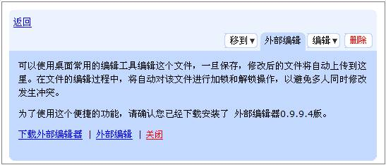
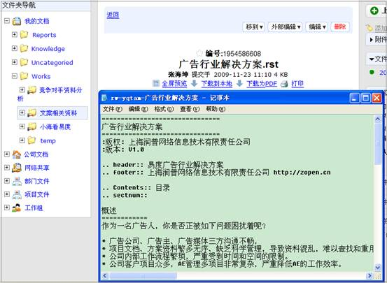
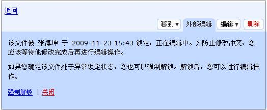

====================================================================
有了它，文档编辑如此简单！—易度外部编辑器
====================================================================

大家好，还记得我吗，我是易度的新人小海，来公司工作快一个月了，已经基本熟悉公司和工作岗位了，工作收获也很大。最近开始独立接手文案工作了，也就经常需要修改大量的文档，对于文档修改我一直有个困惑问题，就是如果每次都需要把文件下载下来，修改后再上传操作，还不麻烦死了。不过，幸好有了易度文档管理系统的外部编辑，它改变了我对传统文档编辑的印象，通过外部编辑，可对储存在文档系统中的常用格式文件（doc、xls、ppt、txt、html）等进行在线修改，同时把修改后的结果自动保存在文档系统中，解决了我关于文档修改方面的困惑，让我工作起来更加高效率。下面就通过截图向大家具体演示下我是如何通过外部编辑器轻松解决我文档修改的困惑难题的。

首先选择需要修改内容的文件，点击界面上方的外部编辑功能按钮，进入在线编辑界面。提示：初次使用需按照提示安装润普外部编辑器。

系统将出现如下提示界面帮助信息

选择外部编辑，就可以直接激活word、txt等桌面编辑器进行编辑，并可自动保存文件到服务器。 

编辑过程系统自动保存修改的文件内容，大大简化通常的文件上传的复杂操作，实现了和桌面编辑器的无缝集成。

另外，为了解决多人同时对文档进行修改而引起的安全性问题，外部编辑提供文档锁定、解锁功能。自动管理文档的修改锁，避免多人同时修改同一文件发生冲突。
具体包括：
* 编辑自动加锁，完成编辑自动解锁 
* 加锁检测和提醒 
* 异常情况下，支持强制解锁 

    当用户打开外部编辑进入在线编辑界面时，系统自动会分配给该用户一个文档锁，其他用户如果想同时对该文档进行修改，系统就会自动检测并提醒该文件已被锁定，正在编辑中，为防止修改冲突，您应该等待他修改完成后再进行编辑操作。

    如果您确定该文件处于异常锁定状态，您也可以强制解锁。解锁后，您可以进行编辑操作。如下图所示：

如果您的企业有大量的office常用文件，经常需要修改文件内容，外部编辑就可以轻松帮您解决文档编辑问题。或者当几个人合作编辑一个设计方案或更新修改产品资料的部分内容时都可以方便快捷地利用外部编辑在线修改。

有了外部编辑器，工作过程中需要进行文档编辑时不再需要花大量时间在文件的上传下载中，也不必担心其他异常操作影响文档内容的保存，工作起来更加有效率。所以我说有了它，文档编辑如此简单！—易度外部编辑器

