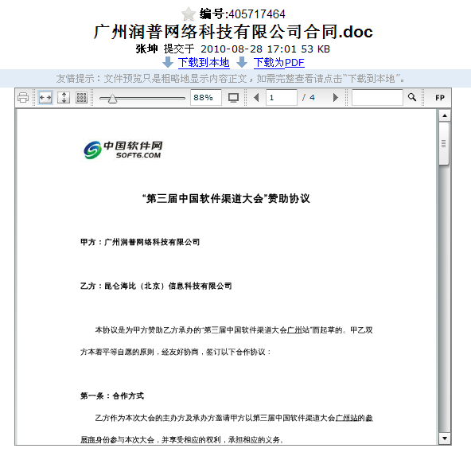

==========================================
如“百度文库”般的查看文档
==========================================

百度，是国内互联网的龙头老大之一。最近发布的百度文库，就让很多人喜欢：

http://wenku.baidu.com

百度文库是一个在线文档交换的网站，最大的特性就是无需任何插件，在线查看(实际上是使用flash)。

而易度，早在2.4版本，就已经支持了在线pdf的flash预览。
但是其他常用office文档的预览，由于是转换为html，因此存在部分的失真现象。

而最新的3.1版本中，所有的office文档(包括doc/docx/ppt/pptx/xls/xlsx等)，都可以支持无损的flash预览了！
而且可以提供同样“高保真”的pdf下载功能。

这一特性的发布，同时标志着易度在 **文档放扩散** 解决方案更加完善了：

  对需要进行防扩展控制的用户，限制为在线查看即可。
  没有下载的权限，自然可以解决扩展和泄密的问题了。

这一新特性，可以在我们的 `演示站点 <http://edodocs.com/demo.rst>`__ 中体验。

