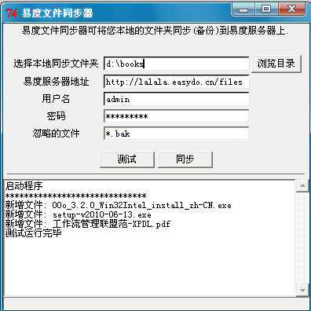

===============================
易度文件同步器放出
===============================

文件同步技术，是当今云存储方面的最新的技术。
使用同步技术，可以智能的识别出本机或者服务器上发生变化的文件。
实现自动化的双向操作同步，并能实现节省带宽的作用。

著名的云存储产品 `DropBox <http://www.dropbox.com>`__ ，
是这个阵营的领跑者。国内的金山快盘也是类似的产品。

今天，易度也释出了自己数据同步产品的第一个版本( `下载 <http://download.zopen.cn/releases/EdoFileSync.exe>`__ )，截图如下:

易度作为一个企业级别的文档存储中心，同步器的意义在于：

1. 提供了一个容错、友好的海量数据导入的工具

   企业往往有数T的数据需要导入，传统拷贝，一旦失败，可能需要全部重来。使用易度同步器，可以从上次拷贝失败的地方开始重新拷贝。这样节省了时间。

2. 不改变现有工作方式，实现文档自动备份。

   员工还是以自己硬盘上作为工作中心，增删改文件，会自动同步到服务器。这样用户无需改变自己现有的工作模式，最大程度的减轻了管理工具带来的工作模式改变阵痛。

易度文件同步器，是易度产品线的一个重要产品。
目前只是第一个版本，在功能上，主持GUI和命令行2种操作方法，但目前只是实现了本机到服务器的单向同步。

这个产品现在可免费下载，可用于所有支持webdav协议的服务器上传。
